# GarageOS — Documento di Specifiche

> **Stato del documento:** v1.6 (Neon → Supabase + Appendice C Infrastructure, tutte le sezioni + Appendici A, B, C, E, F, G)
> **Ultimo aggiornamento:** 23 aprile 2026
> **Documenti correlati:** `APPENDICE_A_API.md`, `APPENDICE_B_DATABASE.md`, `APPENDICE_E_TESTING.md`, `APPENDICE_F_BUSINESS_LOGIC.md`, `APPENDICE_G_ERROR_CODES.md`, `garageos-officina-design.jsx`, `garageos-cliente-design.jsx`
> **Autori:** Team di progetto
> **Scopo:** documento funzionale e tecnico di riferimento per lo sviluppo del sistema GarageOS. Viene aggiornato in modo incrementale man mano che si raffinano le scelte progettuali.

---

## Indice

1. [Vision & Obiettivi](#1-vision--obiettivi) ✅
2. [Contesto & Utenti](#2-contesto--utenti) ✅
3. [Funzionalità principali](#3-funzionalità-principali) ✅
4. [User Flows](#4-user-flows) ✅
5. [Architettura tecnica](#5-architettura-tecnica) ✅
6. [Modello dati](#6-modello-dati) ✅
7. [API & Interfacce](#7-api--interfacce) ✅ (dettaglio in `APPENDICE_A_API.md`)
8. [Design & UI](#8-design--ui) ✅ (mockup in `garageos-officina-design.jsx` e `garageos-cliente-design.jsx`)
9. [Requisiti non funzionali](#9-requisiti-non-funzionali) ✅
10. [Roadmap & Fasi di rilascio](#10-roadmap--fasi-di-rilascio) ✅
11. [Glossario & Appendici](#11-glossario--appendici) ✅
6. [Modello dati](#6-modello-dati) ⏳
7. [API & Interfacce](#7-api--interfacce) ⏳
8. [Design & UI](#8-design--ui) ⏳
9. [Requisiti non funzionali](#9-requisiti-non-funzionali) ⏳
10. [Roadmap & Fasi di rilascio](#10-roadmap--fasi-di-rilascio) ⏳
11. [Glossario & Appendici](#11-glossario--appendici) ⏳

Legenda: ✅ completata · ⏳ da completare · 🔄 in revisione

---

## 1. Vision & Obiettivi

### 1.1 Executive Summary

**GarageOS** è una piattaforma SaaS multi-tenant che digitalizza il tradizionale libretto cartaceo di manutenzione dei veicoli. Sostituisce il libretto fisico che le officine meccaniche italiane compilano ad ogni intervento, creando uno **storico digitale permanente e condiviso** legato al veicolo stesso — non al proprietario — in modo da accompagnare il veicolo per tutta la sua vita utile, anche attraverso cambi di proprietario.

Il sistema è rivolto primariamente alle **officine** (clienti paganti) e in modo complementare ai **proprietari di veicoli** (utenti finali gratuiti), in un modello a **due lati** in cui il valore per ciascun lato cresce con l'adozione dell'altro.

### 1.2 Problema che il sistema risolve

Oggi, quando un veicolo viene sottoposto a un intervento presso un'officina (collaudo, tagliando, riparazione), il meccanico compila manualmente un libretto cartaceo di manutenzione e lo consegna al cliente. Questo approccio presenta limiti significativi:

- **Perdita dello storico**: il libretto cartaceo si smarrisce, si rovina, o non viene consegnato all'acquirente in caso di vendita del veicolo
- **Assenza di promemoria**: il cliente non ha un sistema strutturato che gli ricordi le scadenze (prossimo tagliando, revisione, bollo, cinghia di distribuzione, ecc.)
- **Opacità nella compravendita dell'usato**: chi acquista un veicolo di seconda mano ha poche garanzie sulla storia manutentiva reale
- **Frammentazione delle informazioni**: se il veicolo passa da più officine (per specializzazione o per cambio di proprietario), non esiste un archivio unificato
- **Onere amministrativo per l'officina**: la compilazione manuale ripetitiva e l'assenza di strumenti di storico dei clienti ricorrenti

### 1.3 Proposta di valore

**Per le officine (clienti B2B — utenti paganti):**
- Digitalizzazione immediata del processo di registrazione interventi
- Anagrafica veicoli e clienti centralizzata e ricercabile
- Strumento per fidelizzare il cliente attraverso promemoria di manutenzione
- Riduzione della carta e tempo risparmiato rispetto al libretto cartaceo
- Possibilità di consultare lo storico completo del veicolo al primo accesso (anche se l'intervento precedente è stato fatto da un'altra officina sulla piattaforma)
- Strumenti gestionali di base (clienti, veicoli, appuntamenti, scadenzario)

**Per i proprietari dei veicoli (utenti B2C — gratuiti):**
- Accesso gratuito allo storico completo e certificato degli interventi sul proprio veicolo
- Notifiche automatiche di scadenze (configurate dall'officina)
- Area privata per registrare interventi effettuati in autonomia (cambio olio fai-da-te, piccole manutenzioni)
- Passaggio di proprietà digitale che trasferisce lo storico al nuovo proprietario
- Maggiore valore al veicolo in fase di rivendita (storico dimostrabile)

**Per l'acquirente di un veicolo usato:**
- Consultazione dello storico di manutenzione **prima** dell'acquisto (tramite il venditore)
- Maggiore trasparenza e riduzione del rischio di acquisto

### 1.4 Obiettivi del prodotto

**Obiettivi strategici (business):**
- Lanciare un pilota regionale concentrato su una città italiana per raggiungere massa critica locale
- Raggiungere **10-50 officine attive** entro 12 mesi dal lancio
- Creare un effetto rete positivo: più officine aderiscono → più veicoli hanno storico ricco → maggior valore per l'utente finale → maggior richiesta di adozione da parte dei clienti verso altre officine

**Obiettivi di prodotto (v1):**
- MVP funzionante con: gestione anagrafica officina, registrazione interventi, area cliente finale, scadenzario, passaggio di proprietà
- Supporto a **officina singola** e **officine multi-sede (catene)** tramite architettura multi-tenant omogenea
- Supporto alle principali tipologie di operatori: meccaniche, carrozzerie, gommisti, elettrauto, centri revisione, concessionari con service
- Supporto ai principali tipi di veicolo: auto, moto, furgoni, camion, mezzi agricoli
- Mobile app per il cliente finale (iOS + Android) e web app per le officine

**Fuori scope per la v1 (rimandato a v2+):**
- Flotte aziendali (Poste, noleggio, corrieri) — modello distinto che richiede funzionalità specifiche
- Integrazioni avanzate con servizi esterni (visure ACI/PRA automatiche, portale automobilista)
- Marketplace di ricambi, gestione magazzino, fatturazione elettronica
- Internazionalizzazione (multi-lingua, multi-paese): v1 solo Italia

### 1.5 Mercato e posizionamento

**Mercato di riferimento:** Italia (v1). Lingua italiana, normative italiane (GDPR, fatturazione elettronica per eventuale v2).

**Posizionamento competitivo:**

| Categoria | Esempi | Differenza rispetto a GarageOS |
|---|---|---|
| Gestionali per officina | AutoSoft, OmniaOfficina, Rec Auto | Sono "silos" chiusi, il cliente finale non accede; nessuna continuità tra officine |
| Libretti digitali consumer | MyCar, CarPass | Popolati dal cliente, non certificati dall'officina, poco diffusi |
| Sistemi storici usato | CarFax (USA) | Modello diverso: DB centralizzato con dati da concessionarie/assicurazioni, non dal libretto officina |
| App brandizzate catene | Bosch Car Service, Midas app | Limitate alla singola catena, non trasversali |

**Differenziatore chiave di GarageOS:** è l'unica soluzione che combina (a) popolamento da parte delle officine come fonte autoritativa, (b) accesso gratuito per il cliente finale, (c) continuità trasversale tra officine diverse, (d) persistenza attraverso cambi di proprietario.

### 1.6 Modello di business

**Modello:** B2B SaaS in abbonamento verso le officine. Cliente finale gratuito.

**Struttura di pricing:** da definire in dettaglio (vedi Sezione 10). Ipotesi iniziali da valutare:
- Abbonamento mensile per-sede, con scaglioni per numero di utenti (meccanici) attivi
- Possibile piano Free/Starter limitato per onboarding rapido
- Add-on premium per funzionalità avanzate (es. integrazione con servizi esterni per dati veicolo, reportistica multi-sede per catene)

**Modello multi-tenant scelto:** `Tenant (azienda/officina) → Location (sede fisica) → User (utente con ruolo)`. Un'officina singola è un tenant con una sola location (UI nasconde la complessità multi-sede in questo caso). Le catene sono un tenant con N location e ruoli gerarchici.

### 1.7 Criteri di successo (KPI iniziali)

**A 6 mesi dal lancio:**
- 10 officine attive pilota
- 500 veicoli registrati nel sistema
- 200 clienti finali registrati con almeno 1 veicolo

**A 12 mesi:**
- 30-50 officine attive
- 3.000+ veicoli registrati
- 1.500+ clienti finali registrati
- Tasso di claim dei veicoli da parte dei clienti finali > 40%
- Retention mensile officine > 90%
- NPS officine > 30

### 1.8 Principi guida del prodotto

1. **L'officina è il cliente pagante, ma il cliente finale è l'evangelizzatore** — l'esperienza lato consumatore deve essere eccellente per generare richiesta di adozione bottom-up
2. **Il veicolo è l'entità centrale**, non il cliente. La storia accompagna il veicolo attraverso cambi di proprietario
3. **Semplicità operativa sopra tutto**: un meccanico deve poter registrare un intervento in meno di 2 minuti, anche con le mani sporche su un tablet
4. **Integrità dei dati**: gli interventi registrati dalle officine sono la fonte di verità "certificata". Modificabili entro limiti temporali ristretti (approccio wiki moderato), non cancellabili
5. **Privacy by design**: i dati personali di un proprietario precedente non sono mai visibili al nuovo proprietario, solo gli interventi tecnici
6. **Effetto rete geografico**: lanciare concentrato su una città per creare densità prima di espandersi

### 1.9 Decisioni architetturali chiave prese in questa fase

Queste decisioni vengono formalizzate qui perché impattano tutte le sezioni successive:

- ✅ **Multi-tenancy**: Tenant → Location → User (gerarchia a 3 livelli)
- ✅ **Tipologie di intervento**: due categorie distinte — (a) **interventi officina** (certificati, visibili a proprietari attuali e futuri, modificabili solo con approccio wiki), (b) **interventi privati** (registrati dal cliente finale, visibili solo a lui, non trasferibili al nuovo proprietario)
- ✅ **Identificatore univoco del veicolo**: ogni veicolo nel sistema è identificato da un **codice interno GarageOS** immutabile e indipendente da targa e VIN. Formato `GO-NNN-AAAA` (es. `GO-482-KXRT`) — 3 cifre + 4 lettere maiuscole, stile targa italiana, con alfabeto che esclude caratteri ambigui (no `O`, `I`, `0`, `1`). Questo codice è l'identificatore primario esposto agli utenti; targa e VIN vengono comunque memorizzati come chiavi secondarie di unicità per prevenire duplicati
- ✅ **Emissione del codice — modello "officina-first"**: il codice viene generato dal sistema quando un'officina autorizzata censisce per la prima volta un veicolo (flusso standard, 99% dei casi). L'officina consegna il codice al cliente che lo utilizza per registrarsi sull'app e agganciare il veicolo
- ✅ **Eccezione controllata "utente-first"**: un utente può registrarsi autonomamente e aggiungere un veicolo in stato **"pendente di certificazione"** (inserendo targa, VIN e libretto). In questo stato può registrare solo interventi privati. Al primo passaggio in un'officina GarageOS, l'officina verifica i dati dal libretto fisico e promuove il veicolo a **certificato**, generando in quel momento il codice ufficiale
- ✅ **Tag fisico del veicolo**: alla prima certificazione, l'officina applica sul veicolo (libretto/parabrezza/portachiavi) un adesivo con il codice e un QR code che punta all'app. Questo rende il codice sempre reperibile e accelera le future registrazioni di interventi (scansione QR in officina)
- ✅ **Recupero del codice**: (a) via email/SMS per utenti già registrati, (b) presso qualsiasi officina GarageOS autorizzata presentando il libretto di circolazione, (c) richiesta ad amministratore con verifica documentale come last resort
- ✅ **Prevenzione duplicati**: quando un'officina censisce un veicolo, il sistema cerca per VIN (chiave forte) e per targa (chiave debole) e avvisa se esiste già un veicolo corrispondente, richiedendo conferma prima di creare un nuovo record
- ✅ **Passaggio di proprietà**: il vecchio proprietario fornisce al nuovo il codice GarageOS, che inserisce sull'app per reclamare il veicolo. In alternativa, il nuovo proprietario può richiedere il codice a un'officina autorizzata presentando il libretto di circolazione (post-vendita). Il sistema mantiene lo storico officina, nasconde dati personali e interventi privati del precedente proprietario
- ✅ **Scadenze/promemoria**: configurati dall'officina. v1 no scadenze auto-configurate dal sistema (revisione, bollo) — valutare per v2. **Aggiornamento (2026-06-16):** F-CLI-306 realizza la variante self-service: il cliente crea autonomamente le proprie scadenze con reminder configurabili (assicurazione, bollo, revisione, ecc.). Le scadenze ufficina (F-OFF-401) restano separate e non visibili al cliente. Vedi spec `docs/superpowers/specs/2026-06-16-personal-vehicle-deadlines-design.md`.
- ✅ **Posizionamento: registro tecnico, non gestionale economico**. Il sistema non gestisce prezzi, preventivi, fatture o qualsiasi dato economico. Si concentra esclusivamente sullo storico tecnico degli interventi. Nessuna sovrapposizione con gestionali di officina esistenti
- ✅ **Canali di notifica v1**: push (app mobile) + email. No SMS in v1
- ✅ **Billing v1**: manuale (bonifico + fatturazione elettronica manuale) per la fase pilota. Stripe/self-service in v1.1
- ✅ **Stack cloud**: preferenza (non vincolo) per AWS

---

## 2. Contesto & Utenti

### 2.1 Panoramica degli attori

Il sistema coinvolge tre categorie di attori principali, con relazioni e interessi distinti:

| Attore | Categoria | Paga? | Ruolo nel sistema |
|---|---|---|---|
| **Officina** (tenant) | B2B | ✅ Sì (abbonamento) | Censisce veicoli, registra interventi, configura scadenze |
| **Cliente finale / proprietario veicolo** | B2C | ❌ No (gratuito) | Consulta storico, riceve notifiche, registra interventi privati, gestisce passaggi di proprietà |
| **Acquirente di usato** | Influencer | ❌ No (non registrato) | Consulta storico condiviso dal venditore al momento dell'acquisto. Può diventare cliente finale dopo l'acquisto |

### 2.2 Personas

Per dare concretezza al design del sistema, si definiscono tre personas rappresentative che guideranno le decisioni di UX e prodotto.

#### Persona A — Giuseppe, titolare di officina meccanica tradizionale

- **Profilo:** 52 anni, titolare da 20 anni di un'officina meccanica generica in una piccola città, 2 dipendenti meccanici più lui stesso
- **Competenze digitali:** basse. Usa WhatsApp, posta elettronica, un gestionale fatturazione "di base". Non ha mai usato un CRM o un gestionale strutturato
- **Strumenti attuali:** libretto cartaceo di manutenzione, agendina appuntamenti, fogli Excel per i clienti abituali
- **Dolori principali:**
  - Clienti che perdono il libretto e chiedono di ricostruire lo storico
  - Ricostruire a memoria cosa ha fatto 6 mesi fa sul veicolo
  - Dimenticarsi di richiamare i clienti per i tagliandi periodici (perdita di fatturato)
  - Passaggio di consegne tra meccanici quando è in ferie
- **Motivazioni ad adottare GarageOS:**
  - Apparire moderno e professionale ai clienti
  - Fidelizzare attraverso promemoria automatici
  - Ridurre la carta in officina
- **Requisiti chiave di prodotto per Giuseppe:**
  - Interfaccia semplicissima, zero curva di apprendimento
  - Poche funzioni ma ben fatte
  - Assistenza in italiano, telefonica se possibile
  - Prezzo accessibile per una micro-impresa

#### Persona B — Marco, cliente finale attento

- **Profilo:** 38 anni, impiegato, proprietario di una Volkswagen Golf del 2019
- **Competenze digitali:** alte. Usa app bancarie, delivery, home banking, IO, app della PA
- **Comportamento attuale:** tiene un foglio di note sul telefono con date e km dei tagliandi, controlla scadenze sul calendario personale, conserva scrupolosamente ricevute e fatture
- **Dolori principali:**
  - Dimenticarsi scadenze (gli è successo di saltare una revisione)
  - Non avere lo storico sotto mano quando cambia officina
  - Volontà di dimostrare la buona manutenzione quando rivenderà l'auto
- **Motivazioni ad adottare GarageOS:**
  - Storico ordinato e accessibile in ogni momento
  - Ricevere promemoria automatici
  - Valorizzare l'auto in fase di rivendita
  - Controllare che l'officina abbia fatto davvero quello che gli è stato fatturato
- **Requisiti chiave di prodotto per Marco:**
  - App mobile nativa, notifiche push affidabili
  - Export PDF dello storico per condividerlo con eventuali acquirenti
  - Possibilità di registrare anche interventi fai-da-te (area privata)
  - Trasparenza sui dati: deve vedere chi ha fatto cosa e quando

#### Persona C — Laura, acquirente di usato

- **Profilo:** 29 anni, in cerca della sua prima auto usata con budget limitato
- **Competenze digitali:** medio-alte. Consulta AutoScout24, Subito, Facebook Marketplace
- **Comportamento attuale:** chiede consigli a parenti/amici competenti, controlla manualmente tagliandi cartacei, porta l'auto da un meccanico di fiducia per controllo pre-acquisto
- **Dolori principali:**
  - Impossibile verificare la veridicità dello storico dichiarato dal venditore
  - Paura di nascondere incidenti, km truccati, manutenzioni non fatte
  - Costo del controllo pre-acquisto meccanico
- **Motivazioni indirette verso GarageOS:**
  - Se il venditore le mostra uno storico GarageOS certificato da officine reali, si fida di più e accetta un prezzo maggiore
  - Dopo l'acquisto, diventa cliente finale (Persona B) continuando lo storico
- **Ruolo strategico nel prodotto:**
  - Laura non è un utente pagante né registrato inizialmente
  - È un **moltiplicatore di valore percepito**: la sua esistenza giustifica perché Marco vuole usare GarageOS (mi valorizza l'auto) e perché Giuseppe vuole usarlo (i miei clienti vogliono lo storico digitale)

### 2.3 Ruoli e permessi nel sistema

#### Lato officina (tenant) — v1

La v1 adotta un modello semplificato a **due ruoli** per ridurre la complessità di configurazione nelle piccole officine (target del pilota):

| Ruolo | Scopo | Permessi principali |
|---|---|---|
| **Super Admin** (titolare) | Amministra il tenant | Configura il tenant, gestisce le location, invita e rimuove meccanici, gestisce abbonamento/fatturazione, vede tutti i dati di tutte le location, vede reportistica aggregata, può eseguire tutte le operazioni dei meccanici |
| **Meccanico** | Opera sul campo | Cerca veicoli (per codice, targa, VIN), censisce nuovi veicoli e clienti, registra interventi, consulta storico veicoli, configura scadenze, gestisce appuntamenti. Opera all'interno della propria location di appartenenza |

**Regole operative:**
- Nella v1 **non esiste un ruolo distinto di receptionist**: il meccanico stesso può censire nuovi veicoli e clienti
- Nelle **catene multi-sede** il Super Admin vede tutte le sedi; ogni meccanico è assegnato a una sede specifica e vede i dati della propria sede
- **Audit log**: ogni azione (creazione, modifica, consultazione di dati personali) è tracciata con `tenant_id + location_id + user_id + timestamp + action`
- **Ruoli aggiuntivi (Responsabile sede, Receptionist, Sola lettura) sono rimandati a v2**

#### Lato cliente finale — v1

| Ruolo | Scopo | Permessi principali |
|---|---|---|
| **Proprietario veicolo** | Consulta e gestisce i propri veicoli | Aggiunge veicoli tramite codice GarageOS, consulta storico officina, gestisce interventi privati, riceve e gestisce notifiche di scadenze, avvia passaggio di proprietà, contesta interventi |

**Regole operative:**
- Nella v1 **un veicolo ha un solo proprietario** nel sistema (co-intestazione e condivisione familiare rimandate a v2)
- Il proprietario può avere **più veicoli** associati al proprio account

### 2.4 Modello di accesso e privacy ai dati

Questa è un'area critica del sistema. Le regole sono definite in modo da bilanciare **utilità del sistema** (serve che lo storico tecnico sia ampiamente accessibile) e **tutela della privacy** (i dati personali vanno protetti rigorosamente).

#### 2.4.1 Accesso ai dati tecnici del veicolo

**Qualsiasi officina del circuito** può cercare un veicolo (per codice GarageOS, targa o VIN) e accedere a:
- Dati anagrafici del veicolo (marca, modello, anno, VIN, targa, cilindrata, ecc.)
- Storico completo degli interventi officina (fonte: tutte le officine che sono passate prima)

Razionale: questa è la **missione core del sistema**. Un veicolo arriva in officina, il meccanico deve poter sapere cosa è stato fatto prima, indipendentemente da chi lo ha fatto.

#### 2.4.2 Accesso ai dati personali del proprietario

I **dati personali** (nome, cognome, email, telefono, indirizzo) del proprietario **NON** sono visibili liberamente alle officine. Regole:

- Un'officina vede i dati personali di un proprietario **solo se ha registrato almeno un intervento** per quel cliente (cioè li ha acquisiti direttamente perché il cliente è stato fisicamente in officina)
- Al primo accesso al veicolo, un'officina vede solo dati tecnici; deve acquisire i dati personali dal cliente in presenza (come fa oggi con il libretto cartaceo)
- I dati personali **non sono mai condivisi tra tenant diversi** tramite il sistema

#### 2.4.3 Trasparenza e audit verso il cliente

Per compensare la libera accessibilità dei dati tecnici e garantire fiducia nel sistema:

- **Audit log accessi**: ogni accesso alla scheda di un veicolo viene registrato e reso visibile al proprietario in una sezione dedicata dell'app (chi, quando, da quale officina). **Non viene generata una notifica push** per ogni accesso, per evitare rumore: la trasparenza è garantita dall'accesso volontario all'audit log
- **Notifica di intervento**: ogni nuovo intervento registrato genera una notifica push + email al proprietario con dettagli
- **Notifica di scadenza**: promemoria push + email in anticipo sulle scadenze configurate
- **Contestazione**: il proprietario può contestare qualsiasi intervento registrato dalle officine. L'intervento non viene cancellato ma marcato come "contestato dal proprietario" — questo segno rimane visibile ai futuri acquirenti per trasparenza bidirezionale
- **Audit log operazioni**: il proprietario vede nella sua app la cronologia completa degli accessi al suo veicolo e delle modifiche

#### 2.4.4 Passaggio di proprietà e privacy

Al passaggio di proprietà (vedi §1.9):
- Il nuovo proprietario **vede tutto lo storico officina** (interventi, date, km, descrizioni, costi se disponibili)
- Il nuovo proprietario **NON vede**: dati personali del precedente proprietario, interventi privati del precedente proprietario, note riservate tra officina e precedente proprietario
- Le officine che avevano i dati del precedente proprietario **li conservano** (hanno un rapporto commerciale storicizzato con lui) ma non li condividono con il nuovo proprietario

### 2.5 Scenari d'uso tipici

Si descrivono i principali scenari per dare contesto narrativo al sistema. I flussi di dettaglio sono nella [Sezione 4 — User Flows](#4-user-flows).

#### Scenario 1 — Primo intervento su nuovo veicolo

Mario arriva nell'officina di Giuseppe con la sua nuova Panda per un tagliando. Giuseppe apre GarageOS sul PC del banco, cerca la targa: il veicolo non esiste. Clicca "Nuovo veicolo", inserisce i dati dal libretto di circolazione (marca, modello, VIN, anno, data immatricolazione) e i dati di Mario (nome, cognome, email, telefono). Il sistema genera automaticamente il codice `GO-482-KXRT`. Giuseppe stampa un adesivo con codice e QR code e lo applica sul libretto di Mario. Giuseppe registra il tagliando (data, km, operazioni fatte, prossima scadenza tra 15.000 km). Mario riceve via email un link per scaricare l'app. Scarica, si registra, inserisce il codice `GO-482-KXRT` e vede subito il tagliando che Giuseppe ha appena registrato.

#### Scenario 2 — Intervento su veicolo già registrato da altra officina

Marco si sposta per lavoro e deve fare il cambio gomme a Roma. Va in un'officina GarageOS di Roma che non conosce. Porge il codice `GO-288-QPWZ` della sua Golf (ce l'ha sul libretto). Il meccanico di Roma cerca per codice, apre la scheda e vede tutto lo storico: tagliando 3 mesi fa a Milano, precedente cambio gomme a Verona l'anno scorso. Registra il nuovo cambio gomme. Marco riceve notifica push e vede l'intervento nell'app.

#### Scenario 3 — Acquisto usato

Laura trova una Fiat Punto usata su un sito di annunci. Il venditore, orgoglioso, le dice "ha tutto lo storico GarageOS". Le condivide un link (PDF esportato o link di condivisione limitata nel tempo). Laura vede 8 anni di tagliandi e interventi certificati da 3 officine diverse. Si fida, compra. Dopo l'acquisto, chiede al venditore il codice `GO-991-LWXR`. Scarica l'app, si registra, inserisce il codice. Avvia il "passaggio di proprietà". Il venditore conferma dall'app. Laura è ora proprietaria nel sistema: vede lo storico, non vede i dati personali del venditore, non vede eventuali interventi privati del venditore.

#### Scenario 4 — Recupero codice smarrito

Marco perde il portachiavi con il tag GarageOS. Va in qualsiasi officina del circuito, presenta il libretto di circolazione. Il meccanico cerca per targa o VIN, verifica l'identità di Marco con un documento, ristampa il tag con lo stesso codice `GO-288-QPWZ`.

### 2.6 Contesto fisico d'uso e vincoli operativi

#### 2.6.1 Piattaforma per le officine

**Scelta architetturale: Web responsive unica (non app nativa per v1).**

**Razionale:**
- Il dispositivo primario individuato è il **PC desktop al banco di accettazione**, per il quale il web è naturalmente ottimizzato
- Zero onere di installazione: l'officina apre il browser e usa il sistema
- Nessun processo di approvazione store, aggiornamenti immediati per tutti gli utenti
- Single codebase, ridotti costi e tempi di sviluppo per la v1
- Web responsive copre anche l'uso occasionale da tablet o smartphone

**Requisiti tecnici minimi lato officina:**
- Browser moderno (Chrome/Edge/Firefox/Safari aggiornati agli ultimi 2 anni)
- Connessione internet stabile
- Risoluzione minima 1280x720; UI ottimizzata per 1920x1080 (desktop standard)
- Stampante connessa per adesivi con codice/QR (qualsiasi stampante A4 o etichette)

**Futuro (post v1):** valutare PWA installabile o app mobile nativa se emergono esigenze specifiche di scanner QR rapido, accesso camera ottimizzato, o notifiche push dedicate.

#### 2.6.2 Piattaforma per i clienti finali

**Scelta architetturale: App mobile nativa (iOS + Android).**

**Razionale:**
- I clienti finali usano prevalentemente lo smartphone
- Le notifiche push sono **critiche** (promemoria scadenze, notifiche di intervento, accessi al veicolo)
- L'app è il touchpoint principale quotidiano, deve essere facile da trovare e aprire
- Accesso camera per scansione codice QR del tag veicolo

**Valutazione tecnologica (da dettagliare in Sezione 5):**
- React Native / Flutter per condividere codebase iOS+Android
- Oppure Swift + Kotlin per qualità nativa massima
- Da decidere in fase di architettura tecnica

**Accesso web complementare per i clienti finali:** valutare una versione web "vista storico" accessibile da desktop (per stampare PDF, condividere con acquirenti in fase di vendita). Da considerare come nice-to-have per v1.

#### 2.6.3 Momento di registrazione degli interventi

L'intervento può essere registrato in **due momenti** diversi a seconda dell'abitudine dell'officina:

- **Registrazione contestuale**: il meccanico registra l'intervento al PC del banco mentre il cliente è ancora presente (tipico di officine piccole con flusso lineare)
- **Registrazione differita**: il meccanico annota su carta/mentalmente e registra a fine giornata tutti gli interventi in blocco (tipico di officine più grandi con flusso intenso)

Il sistema **supporta entrambi** senza distinzioni: la data dell'intervento è un campo esplicito e può differire dalla data di creazione del record.

#### 2.6.4 Connettività e modalità offline

**Requisito: connessione online sempre richiesta per le scritture.**

**Modalità offline degradata:**
- **Consultazione offline temporanea**: l'app mantiene in cache locale gli ultimi veicoli consultati. Se la connessione cade, il meccanico può continuare a consultare finché non recupera la connessione
- **Scrittura offline**: non supportata nella v1. Se la connessione è assente, un banner informa l'utente e il form resta compilato localmente (recupero stato alla riconnessione)
- **Razionale**: il banco accettazione ha normalmente connessione fissa stabile; la complessità di un sistema full-offline con sync e conflict resolution non è giustificata nella v1

**Requisito minimo di connessione:** 4 Mbit/s download, 2 Mbit/s upload. In caso di officine con connettività problematica (seminterrati, zone bianche), si consiglia router 4G di backup.

### 2.7 Vincoli di accessibilità e usabilità

- **Lingua**: italiano nativo per v1. L'architettura deve supportare i18n future (stringhe esternalizzate, formati date/numeri configurabili)
- **Accessibilità web**: conformità WCAG 2.1 livello AA come obiettivo
- **Target utenti a bassa alfabetizzazione digitale** (Persona A, Giuseppe): UI semplice, pochi click per le operazioni frequenti, terminologia colloquiale non tecnica, onboarding guidato
- **Target utenti mobili** (Persona B, Marco): rapidità di consultazione, notifiche chiare, flussi ottimizzati per pollice singolo


---

## 3. Funzionalità principali

### 3.1 Nomenclatura delle priorità

Ogni funzionalità è classificata secondo una delle seguenti priorità:

- **🟢 MUST (v1)**: funzionalità obbligatoria per il rilascio della v1. Senza di essa il sistema non è utilizzabile per il suo scopo
- **🟡 SHOULD (v1)**: funzionalità importante per la v1, ma il sistema può essere lanciato senza di essa se necessario per rispettare i tempi
- **🔵 COULD (v1)**: nice-to-have per la v1. Si aggiunge se c'è tempo, altrimenti rimandata
- **⚪ v2**: funzionalità esplicitamente rimandata alla versione successiva
- **❓ OPEN**: funzionalità con scelte progettuali ancora aperte, da definire prima dell'implementazione

### 3.2 Funzionalità lato officina (Web App)

#### 3.2.1 Area Account e Tenant

| ID | Funzionalità | Descrizione | Priorità |
|---|---|---|---|
| F-OFF-001 | Registrazione tenant | Il titolare di un'officina si registra al sistema creando un tenant. Inserisce: ragione sociale, P.IVA, indirizzo sede principale, dati titolare, email di contatto. Conferma via email | 🟢 MUST |
| F-OFF-002 | Onboarding guidato | Wizard post-registrazione che guida il titolare nella configurazione iniziale (aggiungi location, invita primo meccanico, imposta preferenze officina) | 🟡 SHOULD |
| F-OFF-003 | Gestione location | Il Super Admin può creare/modificare/disattivare le location del tenant. Una location include: nome, indirizzo, telefono, responsabile. Per tenant single-location l'UI nasconde la complessità | 🟢 MUST |
| F-OFF-004 | Gestione utenti (meccanici) | Il Super Admin invita meccanici via email, assegna ruolo (Meccanico o Super Admin) e location di appartenenza. Gestisce rimozione utenti | 🟢 MUST |
| F-OFF-005 | Login / logout / recupero password | Autenticazione standard via email + password. Reset password via email | 🟢 MUST |
| F-OFF-006 | 2FA (autenticazione a due fattori) | Opzionale, attivabile da ogni utente tramite TOTP (Google Authenticator, Authy) | 🔵 COULD |
| F-OFF-007 | Profilo utente | Ogni utente può modificare i propri dati (nome, foto, password). Il Super Admin modifica il profilo tenant | 🟢 MUST |
| F-OFF-008 | Gestione abbonamento | **v1**: billing manuale (bonifico + fatturazione elettronica manuale), dashboard di sola lettura con piano attivo e contatto amministrativo. **v1.1**: integrazione Stripe per self-service subscription, storico fatture, upgrade/downgrade di piano | 🟡 SHOULD |
| F-OFF-009 | Branding officina | Caricamento logo officina, personalizzazione colori del PDF esportato. Non impatta sulla UI del cliente finale | 🔵 COULD |

**❓ OPEN per questa area:**
- Il pagamento e la fatturazione vengono gestiti via Stripe (o simile) in v1? Oppure si parte con billing manuale per i primi 10-50 clienti pilota?

#### 3.2.2 Area Anagrafica Veicoli

| ID | Funzionalità | Descrizione | Priorità |
|---|---|---|---|
| F-OFF-101 | Ricerca veicolo | Barra di ricerca unificata per codice GarageOS, targa, VIN o nome cliente. Autocompletamento | 🟢 MUST |
| F-OFF-102 | Censimento nuovo veicolo | Form di creazione veicolo con: marca, modello, versione, anno, data immatricolazione, targa, VIN, cilindrata, alimentazione (benzina/diesel/elettrico/ibrido/GPL/metano), km attuali, colore, tipo veicolo (auto/moto/furgone/camion/mezzo agricolo). Controllo duplicati per VIN e targa con avviso | 🟢 MUST |
| F-OFF-103 | Generazione codice GarageOS | Al salvataggio del nuovo veicolo, il sistema genera automaticamente il codice `GO-NNN-AAAA` univoco | 🟢 MUST |
| F-OFF-104 | Stampa tag/adesivo | Generazione PDF stampabile con codice + QR code pronto per l'applicazione sul veicolo. Formato etichetta standard o A4 con più etichette | 🟢 MUST |
| F-OFF-105 | Scheda veicolo | Vista dettagliata del veicolo: dati tecnici, proprietario (se visibile all'officina), storico interventi, scadenze, audit accessi | 🟢 MUST |
| F-OFF-106 | Modifica dati veicolo | Modifica dei dati tecnici del veicolo. Alcuni campi (VIN, marca, modello) sono modificabili solo in caso di errore manifesto; tracciato in audit | 🟢 MUST |
| F-OFF-107 | Aggancio veicolo pendente | Quando un utente finale ha già pre-registrato un veicolo (modalità "utente-first"), l'officina trova il veicolo pendente per targa/VIN, verifica i dati dal libretto, promuove a certificato e genera il codice ufficiale | 🟡 SHOULD |
| F-OFF-108 | Promemoria di scansione QR | Widget/shortcut per aprire la camera e scansionare un QR GarageOS sul veicolo del cliente (richiede webcam o smartphone) | 🔵 COULD |
| F-OFF-109 | Ristampa tag | L'officina può ristampare il tag di un veicolo esistente (in caso di smarrimento da parte del cliente) previa verifica documentale | 🟢 MUST |
| F-OFF-110 | Trasferimento proprietà in officina | L'officina trasferisce la proprietà di un veicolo certificato da un cliente esistente a un nuovo proprietario in single-step atomic swap. Richiede presenza fisica cedente + verifica libretto. Variante officina-mediated del passaggio proprietà (vedi BR-049). | 🟢 MUST |

#### 3.2.3 Area Anagrafica Clienti

| ID | Funzionalità | Descrizione | Priorità |
|---|---|---|---|
| F-OFF-201 | Creazione cliente | Form con: nome, cognome, codice fiscale (opzionale), email, telefono, indirizzo (opzionale). Possibilità di flaggare come "cliente aziendale" con ragione sociale e P.IVA | 🟢 MUST |
| F-OFF-202 | Elenco clienti | Lista dei clienti del tenant con ricerca/filtri. Ogni cliente mostra: nome, telefono, numero veicoli associati, ultimo intervento | 🟢 MUST |
| F-OFF-203 | Scheda cliente | Dettaglio cliente con: dati personali, veicoli posseduti, storico interventi trasversale, note interne | 🟢 MUST |
| F-OFF-204 | Modifica cliente | Aggiornamento dati del cliente | 🟢 MUST |
| F-OFF-205 | Invio invito all'app | Invio email/SMS al cliente con link per scaricare l'app e istruzioni per il claim del veicolo tramite codice | 🟢 MUST |
| F-OFF-206 | Note riservate officina-cliente | Note visibili solo all'officina, non al cliente finale, non trasferite in caso di passaggio di proprietà | 🟡 SHOULD |
| F-OFF-207 | Import clienti | Import massivo di clienti esistenti da CSV (per officine che già hanno una anagrafica) | 🔵 COULD |

#### 3.2.4 Area Gestione Interventi

| ID | Funzionalità | Descrizione | Priorità |
|---|---|---|---|
| F-OFF-301 | Creazione intervento | Form per registrare un intervento: veicolo (obbligatorio), data intervento, km al momento dell'intervento, tipo intervento (tagliando, riparazione, diagnosi, revisione, carrozzeria, ecc.), descrizione operazioni effettuate, pezzi di ricambio sostituiti (lista libera), note interne. **Nessun campo relativo a costi/prezzi** (scelta di posizionamento: GarageOS è registro tecnico, non gestionale) | 🟢 MUST |
| F-OFF-302 | Tipi di intervento standard | Catalogo predefinito di tipi di intervento (tagliando, cambio gomme, cambio olio, cinghia distribuzione, freni, revisione, ecc.) con icone e categorie. Estendibile dal tenant | 🟢 MUST |
| F-OFF-303 | Template di intervento | Template riutilizzabili per interventi ricorrenti (es. "Tagliando completo Panda") per velocizzare la compilazione | 🔵 COULD |
| F-OFF-304 | Modifica intervento (wiki) | L'intervento può essere modificato liberamente entro una **finestra di 48 ore dalla creazione** oppure fino al **primo accesso del cliente all'intervento nell'app** (quale dei due arriva prima). Oltre questa finestra, le modifiche sono ancora possibili ma sempre tracciate nello storico visibile anche al cliente (chi, cosa, quando). Alcuni campi (VIN veicolo, data intervento, km intervento) sono comunque immutabili dopo la creazione: per correggere errori gravi su questi, si annulla l'intervento e se ne crea uno nuovo | 🟢 MUST |
| F-OFF-305 | Allegati all'intervento | Possibilità di allegare foto (prima/dopo), documenti tecnici, schede prodotto ricambi. Max 10 MB per allegato, max 10 allegati per intervento. Formati: JPG, PNG, HEIC, PDF. Compressione automatica lato server per le immagini (WebP, resize max 2048px, qualità 85%). Nessun documento economico (fatture/scontrini): GarageOS è registro tecnico | 🟡 SHOULD |
| F-OFF-306 | Firma digitale del cliente | Rimandata a v2 — valutazione costo/beneficio non favorevole per v1 nel target delle piccole officine | ⚪ v2 |
| F-OFF-307 | Cancellazione intervento | La cancellazione fisica NON è consentita. Solo "annullamento logico" con motivazione obbligatoria. L'intervento resta visibile ma marcato come annullato. Limitato ai Super Admin | 🟢 MUST |
| F-OFF-308 | Prossima scadenza associata | Al salvataggio di un intervento, suggerimento di creare una scadenza collegata (es. "prossimo tagliando tra 15.000 km o 12 mesi"). L'officina può confermare o personalizzare | 🟢 MUST |
| F-OFF-309 | Export intervento | Generazione PDF del singolo intervento (con logo officina) da consegnare al cliente | 🟡 SHOULD |

#### 3.2.5 Area Scadenzario

| ID | Funzionalità | Descrizione | Priorità |
|---|---|---|---|
| F-OFF-401 | Configurazione scadenza | L'officina configura una scadenza per un veicolo: tipo (tagliando, cambio gomme, cinghia, revisione, altro), data target oppure km target oppure entrambi, descrizione, eventuale nota. L'officina può anche configurare scadenze "ricorrenti" (ogni N mesi/km) | 🟢 MUST |
| F-OFF-402 | Vista scadenze in arrivo | Dashboard delle scadenze raggruppate per: "questa settimana", "questo mese", "prossimi 3 mesi". Filtri per location, tipo scadenza | 🟢 MUST |
| F-OFF-403 | Notifica automatica al cliente | Il sistema invia automaticamente notifiche push/email al cliente finale in anticipo rispetto alla scadenza (es. 30 giorni, 7 giorni, il giorno stesso). Configurabile per tipo | 🟢 MUST |
| F-OFF-404 | Promemoria lato officina | Il sistema segnala anche all'officina le scadenze dei clienti non ancora contattati, per eventuale richiamo commerciale | 🟡 SHOULD |
| F-OFF-405 | Completamento scadenza | Quando viene registrato un intervento che chiude una scadenza, il sistema chiede se marcare come completata | 🟢 MUST |

#### 3.2.6 Area Dashboard e Ricerca

| ID | Funzionalità | Descrizione | Priorità |
|---|---|---|---|
| F-OFF-501 | Dashboard home | Pagina iniziale dopo login con: scadenze dei prossimi 7 giorni, ultimi interventi registrati, clienti in attesa di invito app, eventuali contestazioni aperte | 🟢 MUST |
| F-OFF-502 | Ricerca globale | Barra di ricerca sempre accessibile in alto, che cerca su codice, targa, VIN, nome cliente, telefono cliente | 🟢 MUST |
| F-OFF-503 | Filtri per location | Per tenant multi-location, filtri per restringere ogni vista a una specifica sede | 🟢 MUST |

#### 3.2.7 Area Audit, Contestazioni e Accessi

| ID | Funzionalità | Descrizione | Priorità |
|---|---|---|---|
| F-OFF-601 | Log accessi veicolo | Ogni accesso alla scheda di un veicolo viene registrato (chi, quando, da quale tenant/location). Visibile all'officina per trasparenza | 🟡 SHOULD |
| F-OFF-602 | Gestione contestazioni | L'officina vede gli interventi contestati dai propri clienti e può fornire una contro-risposta (motivazione, allegati). La contestazione resta visibile | 🟢 MUST |
| F-OFF-603 | Audit log operazioni | Tracciamento di tutte le operazioni sensibili (creazione/modifica veicoli, interventi, utenti). Accessibile al Super Admin | 🟡 SHOULD |

#### 3.2.8 Area Reportistica

| ID | Funzionalità | Descrizione | Priorità |
|---|---|---|---|
| F-OFF-701 | Report interventi periodo | Numero e tipologia di interventi registrati in un periodo, filtri per location/meccanico | 🟡 SHOULD |
| F-OFF-702 | Report clienti attivi | Lista clienti con ultimo intervento, clienti inattivi da N mesi (per richiamo commerciale) | 🔵 COULD |
| F-OFF-703 | Report scadenze completate/mancate | Analisi di quante scadenze si trasformano in interventi effettivi | 🔵 COULD |
| F-OFF-704 | Export dati tenant | Esportazione completa dei dati del tenant in formato CSV/Excel (diritto di portabilità GDPR) | 🟢 MUST |

### 3.3 Funzionalità lato cliente finale (Mobile App)

#### 3.3.1 Area Account utente

| ID | Funzionalità | Descrizione | Priorità |
|---|---|---|---|
| F-CLI-001 | Registrazione utente | Registrazione tramite email + password, oppure login social (Google, Apple). Conferma email | 🟢 MUST |
| F-CLI-002 | Login / logout / recupero password | Standard, con biometric login (Face ID / Touch ID) opzionale | 🟢 MUST |
| F-CLI-003 | Onboarding guidato | Tutorial al primo accesso: come aggiungere un veicolo, come funziona il codice GarageOS, privacy | 🟡 SHOULD |
| F-CLI-004 | Profilo utente | Modifica nome, cognome, email, telefono, password, foto profilo | 🟢 MUST |
| F-CLI-005 | Gestione notifiche | Preferenze su quali notifiche ricevere (scadenze, nuovi interventi, primo contatto nuova officina) e su quali canali (push, email). **Nessun SMS in v1** — SMS introdotti in v1.1 come fallback per scadenze critiche quando push non consegnata | 🟢 MUST |
| F-CLI-006 | Eliminazione account | Diritto all'oblio GDPR: l'utente può richiedere la cancellazione del proprio account. I dati anagrafici vengono cancellati, i veicoli restano nel sistema con proprietario "non assegnato" | 🟢 MUST |

#### 3.3.2 Area Veicoli

| ID | Funzionalità | Descrizione | Priorità |
|---|---|---|---|
| F-CLI-101 | Aggiunta veicolo via codice | L'utente inserisce manualmente il codice GarageOS (`GO-NNN-AAAA`) e aggancia il veicolo al proprio account | 🟢 MUST |
| F-CLI-102 | Aggiunta veicolo via QR | Scansione del QR code sul tag fisico del veicolo tramite camera. Auto-popola il codice | 🟢 MUST |
| F-CLI-103 | Aggiunta veicolo via link invito | Click sul link ricevuto via email/SMS dall'officina → app pre-compilata con codice | 🟢 MUST |
| F-CLI-104 | Registrazione veicolo pendente | L'utente senza codice può pre-registrare un veicolo inserendo targa, VIN e caricando foto del libretto. Stato "pendente di certificazione" | 🟡 SHOULD |
| F-CLI-105 | Elenco veicoli | Vista di tutti i veicoli associati all'account utente, con thumbnail (foto o icona tipo), dati essenziali | 🟢 MUST |
| F-CLI-106 | Dettaglio veicolo | Vista completa: dati tecnici, storico interventi (officina + privati), scadenze, audit accessi | 🟢 MUST |
| F-CLI-107 | Modifica dati non tecnici | L'utente può aggiungere/modificare: nome personalizzato del veicolo (es. "La Panda di nonno"), foto del veicolo, km attuali (solo aggiornamento, non correzione di km officina) | 🟡 SHOULD |
| F-CLI-108 | Rimozione veicolo | L'utente può rimuovere l'associazione di un veicolo al proprio account. Questo non cancella il veicolo dal sistema, solo l'associazione (il veicolo diventa "non assegnato") | 🟢 MUST |

#### 3.3.3 Area Interventi

| ID | Funzionalità | Descrizione | Priorità |
|---|---|---|---|
| F-CLI-201 | Elenco interventi officina | Lista cronologica inversa degli interventi certificati dalle officine, con tipo, data, km, officina che ha eseguito | 🟢 MUST |
| F-CLI-202 | Dettaglio intervento officina | Vista completa dell'intervento con operazioni effettuate, pezzi sostituiti, allegati, officina che ha eseguito | 🟢 MUST |
| F-CLI-203 | Registrazione intervento privato | Form per registrare interventi fai-da-te o eseguiti al di fuori del circuito: data, km, tipo, descrizione, allegati opzionali | 🟢 MUST |
| F-CLI-204 | Modifica/cancellazione intervento privato | Gli interventi privati sono modificabili e cancellabili dall'utente senza restrizioni | 🟢 MUST |
| F-CLI-205 | Distinzione visiva officina vs privato | Nella timeline, gli interventi officina hanno un badge "certificato" visualmente distinto dagli interventi privati | 🟢 MUST |
| F-CLI-206 | Contestazione intervento officina | L'utente può contestare un intervento officina (scrivendo la motivazione). L'intervento resta ma viene marcato come contestato. L'officina riceve notifica e può rispondere | 🟢 MUST |

#### 3.3.4 Area Scadenze e Notifiche

| ID | Funzionalità | Descrizione | Priorità |
|---|---|---|---|
| F-CLI-301 | Vista scadenze | Lista delle scadenze aperte sui propri veicoli, ordinate per urgenza | 🟢 MUST |
| F-CLI-302 | Notifiche push scadenze | Notifiche in anticipo rispetto alla scadenza (30 giorni, 7 giorni, giorno stesso) | 🟢 MUST |
| F-CLI-303 | Notifiche push nuovi interventi | Notifica quando un'officina registra un nuovo intervento su uno dei veicoli | 🟢 MUST |
| F-CLI-304 | Audit accessi al veicolo | Sezione in-app dove il proprietario vede l'elenco degli accessi alla scheda del proprio veicolo (quale officina, quando). **Nessuna notifica push** per questi eventi: trasparenza passiva tramite audit log consultabile. Decisione motivata dalla volontà di evitare rumore di notifiche che porterebbe l'utente a disattivare tutte le push | 🟢 MUST |
| F-CLI-305 | Centro notifiche in-app | Elenco di tutte le notifiche ricevute, filtrabili per tipo | 🟡 SHOULD |
| F-CLI-306 | Scadenze personali | Il cliente crea e gestisce scadenze personali sui propri veicoli (assicurazione, bollo, revisione, ecc.) con reminder configurabili via push ed email, indipendenti dall'officina e privati (l'officina non le vede). Rinnovo guidato per scadenze ricorrenti. | 🟢 MUST |

#### 3.3.5 Area Passaggio di proprietà

| ID | Funzionalità | Descrizione | Priorità |
|---|---|---|---|
| F-CLI-401 | Cessione veicolo | Il proprietario avvia il passaggio di proprietà dall'app: genera un codice/link di trasferimento valido N giorni | 🟢 MUST |
| F-CLI-402 | Acquisizione veicolo venduto | Il nuovo proprietario inserisce il codice GarageOS o il link di trasferimento → conferma acquisizione → il sistema trasferisce la titolarità | 🟢 MUST |
| F-CLI-403 | Doppia conferma | Il passaggio di proprietà richiede conferma da entrambe le parti (vecchio e nuovo proprietario) per prevenire abusi | 🟢 MUST |
| F-CLI-404 | Acquisizione senza cedente | Se il vecchio proprietario non è raggiungibile/registrato, il nuovo proprietario può richiedere il claim autonomo tramite upload libretto → validazione manuale o presso officina | 🟡 SHOULD |
| F-CLI-405 | Pulizia interventi privati | Al passaggio di proprietà, gli interventi privati del precedente restano invisibili al nuovo. Non è possibile "portarli con sé" perché legati al veicolo, ma sono esclusi dal trasferimento | 🟢 MUST |

#### 3.3.6 Area Condivisione storico

| ID | Funzionalità | Descrizione | Priorità |
|---|---|---|---|
| F-CLI-501 | Export PDF storico | Generazione di un PDF professionale con lo storico completo degli interventi officina del veicolo, utile per mostrarlo a un potenziale acquirente | 🟢 MUST |
| F-CLI-502 | Link di condivisione temporaneo | Generazione di un link pubblico (senza login) che mostra lo storico del veicolo, valido per N giorni, revocabile. Utile per annunci di vendita | 🟡 SHOULD |

### 3.4 Funzionalità trasversali (Amministrazione piattaforma)

Queste funzionalità sono riservate al team interno di GarageOS per il supporto e la gestione della piattaforma.

| ID | Funzionalità | Descrizione | Priorità |
|---|---|---|---|
| F-ADM-001 | Pannello super-admin | Accesso amministrativo con elenco tenant, impersonation per supporto, statistiche globali | 🟢 MUST |
| F-ADM-002 | Gestione tenant | Attivazione/sospensione di tenant, cambio piano, risoluzione problemi di fatturazione | 🟢 MUST |
| F-ADM-003 | Strumenti recupero codice | Il team supporto può cercare un veicolo (per targa/VIN) e recuperare il codice previa verifica documentale | 🟢 MUST |
| F-ADM-004 | Gestione contestazioni non risolte | Cruscotto di contestazioni non risolte dopo N giorni, per intervento del team di moderazione | 🟡 SHOULD |
| F-ADM-005 | Monitoraggio abusi | Rilevamento pattern sospetti (stesso meccanico che consulta molti veicoli non suoi, creazione veicoli duplicati, ecc.) | 🔵 COULD |
| F-ADM-006 | Gestione validazione libretti | Coda di libretti caricati da clienti in modalità "utente-first" da validare manualmente | 🟡 SHOULD |
| F-ADM-007 | Feature flag | Possibilità di abilitare/disabilitare feature per singoli tenant in fase di rollout progressivo | 🔵 COULD |
| F-ADM-008 | Metriche business | Dashboard con KPI: tenant attivi, veicoli registrati, clienti finali, retention, tasso di claim | 🟡 SHOULD |
| F-ADM-009 | Backup e ripristino | Backup giornalieri automatici, possibilità di ripristino point-in-time | 🟢 MUST |

### 3.5 Riepilogo scopo v1

**La v1 comprende tutte le funzionalità 🟢 MUST e, compatibilmente con i tempi, le 🟡 SHOULD.**

Totale indicativo:
- Funzionalità MUST: ~50
- Funzionalità SHOULD: ~15
- Funzionalità COULD: ~12 (da valutare in corso d'opera)
- Funzionalità v2: tutte le decisioni rimandate esplicitamente (flotte, ruoli aggiuntivi, co-intestazione, integrazioni servizi esterni, multi-lingua)

### 3.6 Decisioni chiuse sulle questioni aperte

Le questioni progettuali inizialmente aperte sono state tutte chiuse con le seguenti decisioni:

1. ✅ **Billing (F-OFF-008)**: billing manuale per la fase pilota (bonifico + fatturazione elettronica manuale). Integrazione Stripe per self-service rimandata a v1.1. Razionale: con 10-50 tenant pilota la gestione manuale è sostenibile e consente flessibilità sul pricing; SDI è complesso e va integrato quando il pricing è stabile

2. ✅ **Firma digitale cliente (F-OFF-306)**: rimandata a v2. Razionale: rapporto costo/beneficio non favorevole per il target v1 (piccole officine) dove il device primario è il PC desktop e non un tablet; inoltre è un bisogno non sentito dalle officine tradizionali target

3. ✅ **Finestra wiki modifica intervento (F-OFF-304)**: 48 ore dalla creazione oppure primo accesso del cliente all'intervento nell'app (il più restrittivo dei due). Oltre questa finestra, modifiche ancora possibili ma tracciate e visibili al cliente. Campi immutabili dopo creazione: VIN, data intervento, km intervento

4. ✅ **Campo costo interventi**: **rimosso completamente**. GarageOS è un registro tecnico, non un gestionale economico. Nessun campo prezzo/costo in alcuna parte del sistema. Questa è una decisione di posizionamento strategica: nessuna sovrapposizione con gestionali esistenti (AutoSoft, OmniaOfficina), adozione più semplice, privacy commerciale preservata, maggiore focus sul valore tecnico dello storico veicolo

5. ✅ **Limite storage allegati**: 10 MB per singolo allegato, max 10 allegati per intervento, compressione automatica lato server (WebP 2048px max per immagini). Nessun limite totale per tenant in v1, monitorato internamente. Soft limit con avviso in v1.1 se emergono abusi

6. ✅ **Notifiche via SMS**: nessun SMS in v1 (solo push + email). SMS in v1.1 come fallback per scadenze critiche quando push non consegnata. Anche OTP transazionali via email in v1

7. ✅ **Notifica "accesso al veicolo" (F-CLI-304)**: trasformata in **audit log in-app senza notifica push**. Trasparenza passiva: il proprietario consulta l'audit quando vuole, nessuna push rumorosa. Razionale: evitare che l'utente disattivi tutte le notifiche per "rumore"

---

## 4. User Flows

Questa sezione descrive i principali flussi utente del sistema. Ogni flusso è rappresentato con un diagramma Mermaid (testuale, renderizzabile in GitHub, VS Code, Notion, Obsidian e tutti i principali visualizzatori Markdown) accompagnato da una descrizione testuale e note di dettaglio.

I flussi coprono sia il lato officina (web app) che il lato cliente finale (mobile app), più alcuni flussi trasversali che coinvolgono entrambi.

---

### 4.1 Onboarding officina

**Attore:** Titolare officina (futuro Super Admin del tenant)
**Trigger:** il titolare decide di iscrivere la propria officina a GarageOS
**Obiettivo:** tenant configurato, location attive, primo meccanico invitato

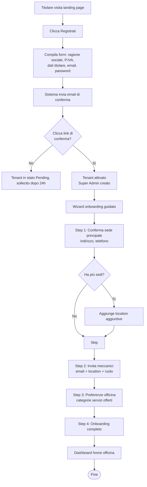

**Note e dettagli:**
- La registrazione può avvenire anche tramite contatto commerciale diretto (in fase pilota), con il team GarageOS che pre-crea il tenant e invia le credenziali al titolare
- Il wizard di onboarding è **skippabile** se il titolare vuole esplorare subito: i passi possono essere completati successivamente dalle impostazioni
- La P.IVA è validata per formato ma non viene verificata attivamente contro registri pubblici in v1
- Per il pilota, l'attivazione del tenant prevede un contatto umano di benvenuto e verifica (riduce il rischio di fake signups e aiuta l'onboarding commerciale)

---

### 4.2 Primo intervento su veicolo nuovo

**Attore:** Meccanico (o Super Admin) in officina
**Trigger:** un cliente arriva con un veicolo mai visto prima nel sistema
**Obiettivo:** veicolo censito, codice generato, intervento registrato, cliente invitato all'app

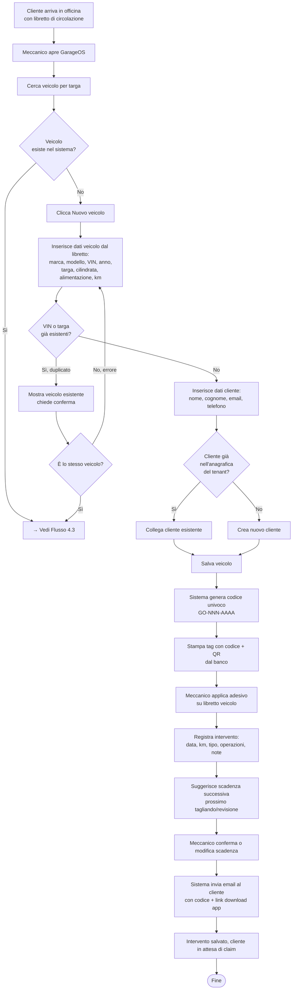

**Note e dettagli:**
- Il **controllo duplicati** è critico: il sistema deve avvisare sia per VIN (match forte) che per targa (match debole, può esserci stato un cambio di targa). Il meccanico deve confermare esplicitamente la creazione di un nuovo record se c'è somiglianza
- La **stampa del tag** è un momento fisico importante: l'officina deve essere attrezzata con una stampante di etichette o A4 con fogli adesivi. Formato standard da definire in fase tecnica
- L'**invito al cliente** è automatico alla prima registrazione ma il cliente può scegliere di non scaricare l'app: in quel caso gli interventi continuano a essere registrati, lo storico esiste, ma non c'è fruizione lato consumer
- Se il meccanico non ha l'email del cliente, può saltare l'invio (campo opzionale al primo intervento). Il cliente potrà sempre reclamare il veicolo inserendo manualmente il codice stampato sul tag

---

### 4.3 Intervento su veicolo già nel sistema

**Attore:** Meccanico
**Trigger:** cliente arriva con un veicolo già registrato (stesso tenant o altro tenant del circuito)
**Obiettivo:** intervento registrato rapidamente consultando lo storico esistente

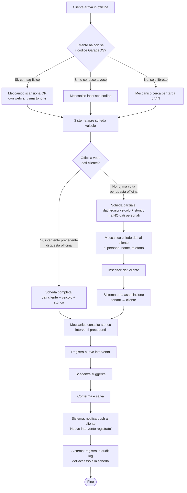

**Note e dettagli:**
- Questo è il flusso **più frequente** nella vita del sistema (dopo qualche mese, la stragrande maggioranza degli interventi sarà su veicoli già registrati)
- La **distinzione tra scheda completa e parziale** (punto G) riflette la regola di privacy §2.4.2: un tenant vede i dati personali del cliente solo se ha un rapporto commerciale storicizzato con lui
- L'**audit log accessi** viene popolato automaticamente: visibile al proprietario, invisibile nelle notifiche push (decisione §3.6.7)
- Se il cliente è un **nuovo proprietario** (veicolo appena passato di proprietà), l'officina vedrà lo storico degli interventi ma non i dati dei precedenti proprietari

---

### 4.4 Onboarding cliente finale + claim veicolo

**Attore:** Cliente finale (proprietario del veicolo)
**Trigger:** cliente riceve email dall'officina con codice GarageOS, o trova il tag sul proprio veicolo, o sente parlare del servizio
**Obiettivo:** account creato, veicolo agganciato, accesso allo storico

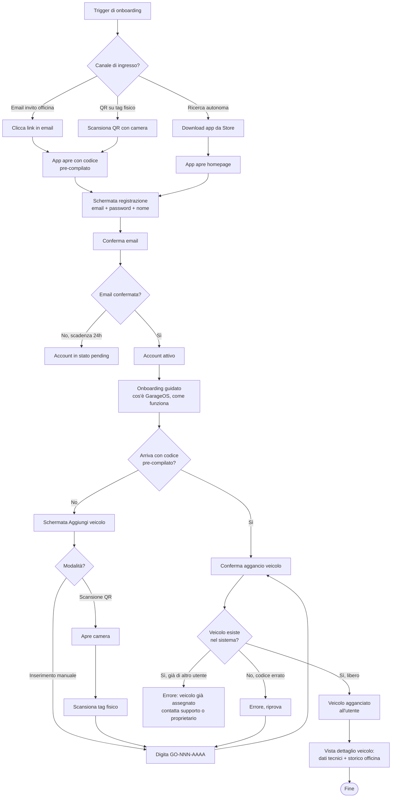

**Note e dettagli:**
- Esistono **tre canali di ingresso** distinti al sistema: link email da officina (più comune), download spontaneo dallo store, scansione QR sul tag
- Il canale via QR è particolarmente elegante perché **pre-compila il codice** nell'app: il cliente deve solo registrarsi e confermare
- La **validazione del codice** (step T) protegge contro errori di battitura ma soprattutto contro furti di identità: se qualcuno prova a inserire un codice di un veicolo già assegnato, il sistema blocca e richiede verifica tramite supporto
- L'errore "veicolo già assegnato" (step V) può essere legittimo (il venditore non ha ancora ceduto) o fraudolento: il supporto GarageOS gestisce manualmente la situazione verificando il libretto
- L'**onboarding guidato** (step L) è cruciale per la Persona A (Giuseppe-like, bassa alfabetizzazione digitale, simile nel parco clienti): spiega i concetti di "interventi officina vs privati", notifiche, privacy

---

### 4.5 Claim via QR scan

**Attore:** Cliente finale
**Trigger:** il cliente trova il tag GarageOS sul proprio veicolo (libretto, parabrezza, portachiavi) e vuole accedervi
**Obiettivo:** aggancio immediato del veicolo senza digitare codici

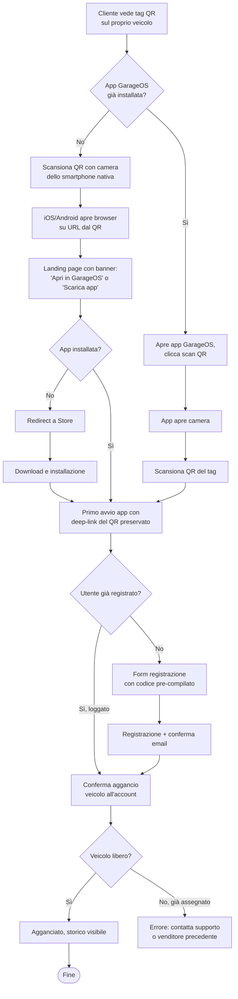

**Note e dettagli:**
- Il **QR code del tag** contiene un URL del tipo `https://app.garageos.it/v/GO-482-KXRT` che:
  - Se l'app è installata: apre direttamente l'app sulla schermata di claim
  - Se non è installata: mostra una landing con invito al download preservando il codice (deep link con differito)
- Il flusso deve funzionare anche per chi **non ha mai sentito parlare di GarageOS**: il cliente trova un QR sul suo veicolo, scansiona per curiosità, scopre il servizio
- La scansione QR **non sostituisce l'autenticazione**: anche dopo la scansione, il cliente deve registrarsi/loggarsi per acquisire il veicolo
- **Sicurezza**: il QR sul tag fisico non è un token di autenticazione, è solo l'identificatore del veicolo. Chi ha il QR può vedere il codice ma non può prendere possesso del veicolo se qualcun altro lo ha già claimato

---

### 4.6 Registrazione intervento privato

**Attore:** Cliente finale
**Trigger:** il cliente ha effettuato un intervento fai-da-te o presso un'officina fuori dal circuito e vuole tenerne traccia
**Obiettivo:** intervento privato registrato, visibile solo al cliente, non trasferito al nuovo proprietario

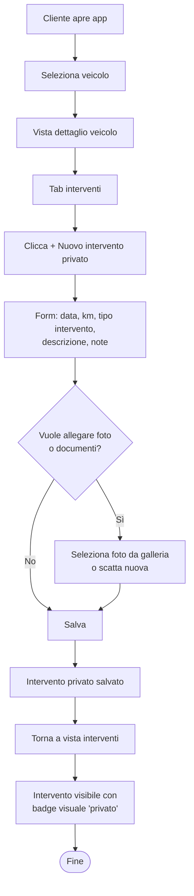

**Note e dettagli:**
- Gli interventi privati sono **facilmente distinguibili** dagli interventi officina nella timeline: badge colorato diverso, icona diversa, etichetta "Registrato da te"
- Il cliente può **modificare o cancellare** gli interventi privati in qualsiasi momento, senza restrizioni (sono dati suoi personali)
- Al passaggio di proprietà (Flusso 4.8), gli interventi privati **restano al vecchio proprietario**: non vengono trasferiti al nuovo né cancellati. Restano associati al profilo utente di chi li ha creati, ma non sono più visibili in quanto il veicolo non è più nella sua lista
- Decisione alternativa valutata e scartata: "trasferire anche interventi privati al nuovo proprietario dopo anonimizzazione". Scartata perché introduce complessità e il valore è incerto
- Gli interventi privati **non appaiono** negli export PDF o nei link di condivisione con acquirenti (sarebbero fuorvianti, sono auto-dichiarati)

---

### 4.7 Configurazione e vita di una scadenza

**Attore:** Meccanico (crea scadenza), Sistema (invia promemoria), Cliente finale (riceve), Meccanico (chiude scadenza con nuovo intervento)
**Trigger:** un intervento porta a definire la scadenza successiva (es. prossimo tagliando)
**Obiettivo:** scadenza tracciata, promemoria inviati puntualmente, cliente richiamato

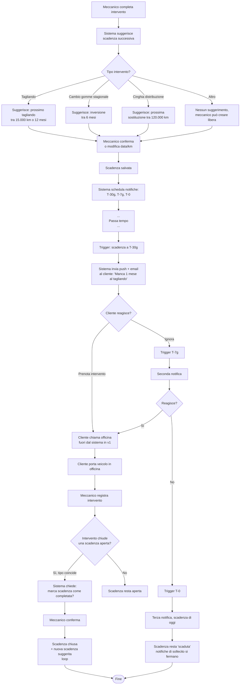

**Note e dettagli:**
- Il **sistema di suggerimento scadenze** (step C) si basa su regole configurate per tipo di intervento. In v1 le regole sono **predefinite** (catalogo standard); in v2 saranno configurabili per tenant
- La **chiusura automatica della scadenza** (step W-X) funziona quando c'è un match chiaro tra tipo intervento e tipo scadenza. Il sistema **chiede conferma** al meccanico, non chiude automaticamente (evita errori)
- In v1 **non c'è prenotazione integrata**: il cliente contatta l'officina fuori dal sistema (telefono, WhatsApp). Il calendario appuntamenti è un potenziale v2
- Le **notifiche T-30g/T-7g/T-0** sono configurabili a livello utente (F-CLI-005): il cliente può disattivarle per tipo o globalmente
- Dopo T-0, il sistema **non continua a sollecitare**: la scadenza resta visibile come "scaduta" in rosso finché non chiusa da un intervento o cancellata manualmente

---

### 4.8 Passaggio di proprietà — happy path

**Attore:** Vecchio proprietario (cedente), nuovo proprietario (cessionario)
**Trigger:** vendita del veicolo tra privati
**Obiettivo:** trasferimento titolarità nel sistema con conservazione dello storico officina

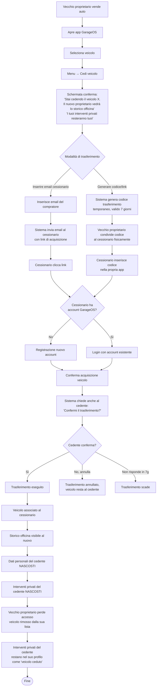

**Note e dettagli:**
- La **doppia conferma** (cedente + cessionario) protegge entrambe le parti: il cedente non può trasferire senza che il cessionario accetti, e il cessionario non può acquisire senza che il cedente confermi
- Il **codice temporaneo** generato (step H) è distinto dal codice GarageOS permanente del veicolo: è un token di trasferimento che scade e che serve solo per questo specifico atto
- Il **link via email** è più comodo ma richiede che il cedente conosca l'email del compratore. Il **codice da condividere fisicamente** è utile quando i due si incontrano di persona (più frequente nella vendita usato tra privati)
- **Anti-abuso**: il sistema registra tutti i passaggi di proprietà. Se lo stesso veicolo cambia di mano molte volte in poche settimane, il sistema alza una flag per revisione manuale
- Gli **interventi privati** del cedente non vengono cancellati — restano associati al suo profilo utente ma marcati come "relativi a veicolo ceduto"

---

### 4.9 Passaggio di proprietà senza cedente

**Attore:** Nuovo proprietario, officina (facoltativa), team supporto GarageOS (se necessario)
**Trigger:** acquisto di veicolo usato dove il cedente non è registrato o non è collaborativo
**Obiettivo:** nuovo proprietario ottiene accesso allo storico senza passare per il cedente

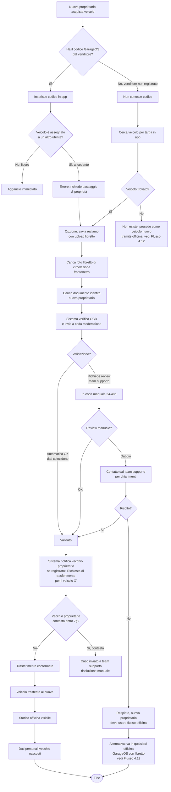

**Note e dettagli:**
- Questo flusso è il **"ricorso di ultima istanza"** quando il passaggio di proprietà standard (4.8) non è possibile
- La **verifica OCR automatica** (step N-O-P) tenta di estrarre targa/VIN dal libretto caricato e confrontarli con i dati del veicolo nel sistema. Se coincidono e il libretto è leggibile, l'approvazione è rapida
- La **review manuale** è necessaria per i casi ambigui: libretti illeggibili, foto di bassa qualità, sospetti di frode
- Il **periodo di contestazione di 7 giorni** al vecchio proprietario (se registrato) è una protezione contro furti di identità o vendite contestate: se il vecchio dice "non ho venduto!" il team indaga
- Il **flusso alternativo tramite officina** (AC) è più semplice ma richiede presenza fisica: vedi Flusso 4.11

---

### 4.10 Contestazione intervento

**Attore:** Cliente finale (contesta), officina (riceve e risponde)
**Trigger:** il cliente riceve notifica di un nuovo intervento e ritiene che qualcosa non sia corretto
**Obiettivo:** segnalazione tracciata in modo trasparente, possibile risposta dell'officina, mantenimento integrità storico

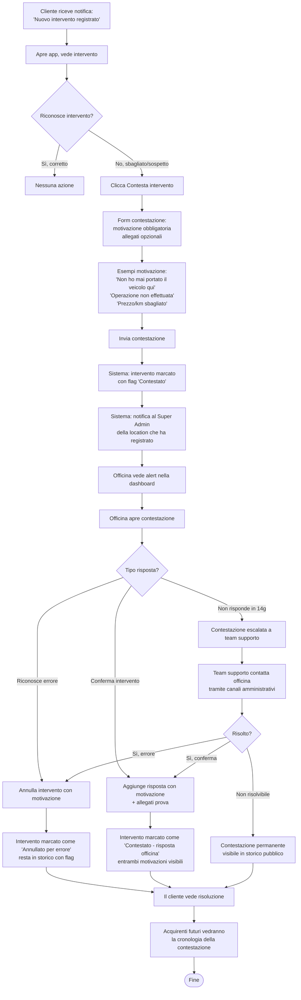

**Note e dettagli:**
- **Principio di trasparenza bidirezionale**: il sistema non "dà ragione" a nessuna delle due parti. Mostra la contestazione del cliente E la risposta dell'officina, lasciando ai futuri acquirenti la valutazione
- L'**intervento non viene mai cancellato fisicamente**: resta sempre in storico, con il giusto flag di stato (contestato, risposto, annullato per errore)
- Il **flag "Contestato"** è un segnale forte visibile negli acquirenti futuri, ma anche il flag "Risposta ufficiale dell'officina" dà elementi per valutare
- L'**escalation a team supporto** dopo 14 giorni è necessaria per casi dove l'officina non risponde (abbandono del sistema, azienda chiusa)
- In caso di **pattern di contestazioni ripetute** contro la stessa officina, il sistema alza flag interni per valutazione commerciale (potenziale espulsione dal circuito)

---

### 4.11 Recupero codice smarrito

**Attore:** Cliente finale (ha perso il tag o dimenticato il codice), officina (supporta)
**Trigger:** cliente non riesce più ad accedere al veicolo perché ha perso il codice
**Obiettivo:** ristampa del tag o recupero del codice tramite identificazione documentale

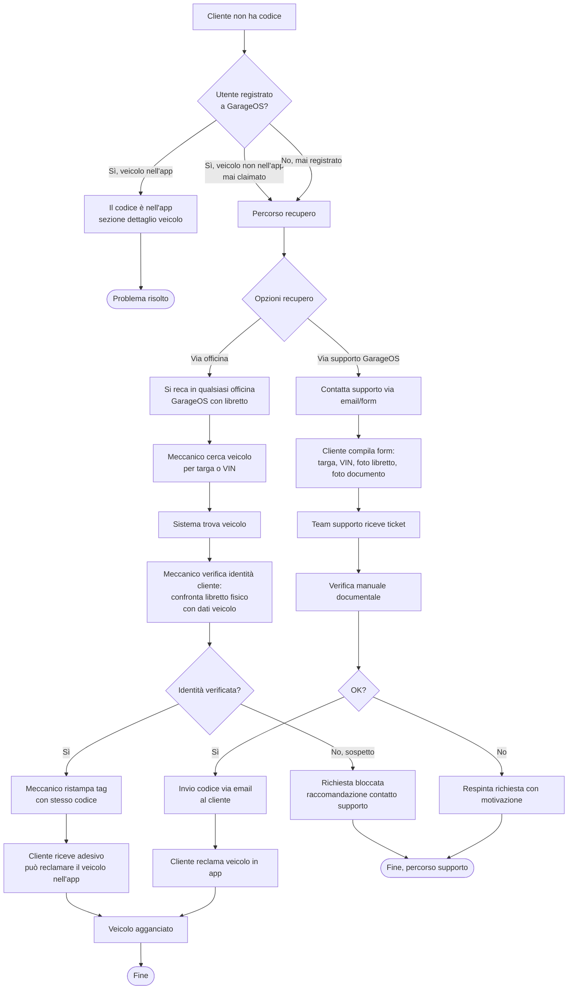

**Note e dettagli:**
- Il **percorso via officina** è il più veloce e pratico: ogni officina del circuito è un punto di contatto fisico per il cliente. Il meccanico agisce come verificatore di identità
- Il **percorso via supporto** serve per chi non ha un'officina GarageOS vicina o preferisce un processo digitale
- La **verifica identità in officina** è un processo semplice: il libretto di circolazione è nominativo, il meccanico verifica corrispondenza tra intestatario del libretto e cliente (documento d'identità)
- **Costo per l'officina**: la ristampa del tag è gratuita e il meccanico dedica 2-3 minuti. È una buona opportunità di contatto con un potenziale nuovo cliente
- In caso di **targhe non corrispondenti** (es. il veicolo ha cambiato targa dopo la registrazione), si usa il VIN come chiave di ricerca più affidabile

---

### 4.12 Veicolo pendente promosso a certificato

**Attore:** Cliente finale (pre-registra), officina (certifica), sistema (promuove)
**Trigger:** un cliente si registra a GarageOS e aggiunge un veicolo prima di passare da un'officina del circuito
**Obiettivo:** il veicolo evolve da "pendente" a "certificato" al primo passaggio in officina, ottenendo il codice ufficiale

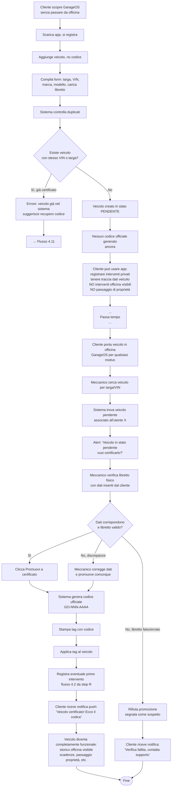

**Note e dettagli:**
- Lo **stato "pendente"** è una funzionalità potente che permette a GarageOS di crescere anche **senza passare sempre dall'officina**: un cliente può iniziare a usare l'app e registrare interventi privati, aspettando il momento giusto per la certificazione
- In stato pendente, le **funzionalità sono limitate**: niente storico officina (perché non esiste), niente passaggio di proprietà (il veicolo non è verificato), niente condivisione pubblica
- La **promozione a certificato** è un'azione dell'officina, non automatica: un essere umano (il meccanico) verifica il libretto fisico prima di emettere il codice ufficiale
- **Controllo duplicati anti-furto**: se qualcuno inserisce targa/VIN di un veicolo già certificato, il sistema blocca la creazione del veicolo pendente e reindirizza al flusso recupero codice
- Questo flusso è anche il **seed principale per le officine di nuova adozione**: un'officina che entra nel sistema può trovare veicoli pendenti dei propri clienti storici e certificarli rapidamente

---

### 4.13 Mappa di interazione tra flussi

Di seguito una mappa sintetica di come i flussi si collegano tra loro:

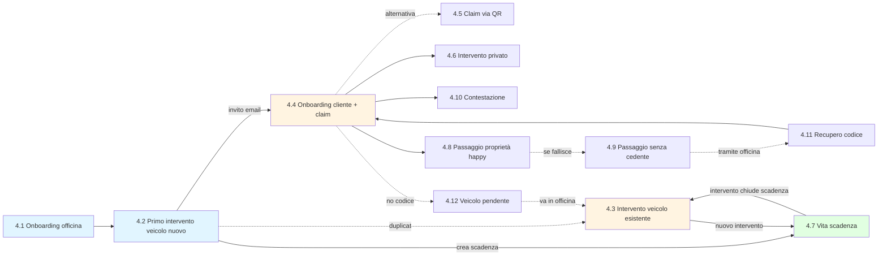

Legenda colori:
- 🔵 Flussi di setup iniziale
- 🟠 Flussi operativi più frequenti
- 🟢 Flussi di automazione (scadenze)

---

### 4.14 Flussi rimandati a v2

Per completezza, si elencano qui i flussi individuati ma esplicitamente **non inclusi** nella v1, coerentemente con lo scope definito:

- **Gestione co-intestatari/veicolo familiare condiviso** — rimandata con v2 flotte/co-intestazione
- **Prenotazione appuntamento in-app** — v2 calendario officine
- **Flotta aziendale onboarding** — v2 flotte
- **Scadenze auto-configurate dal sistema** (revisione obbligatoria biennale, bollo) — v2 integrazione dati pubblici
- **Firma digitale intervento** — v2 (decisione OPEN #2)
- **Pagamento intervento in-app** — fuori scope strategico (registro tecnico, non economico)

---

## 5. Architettura tecnica

Questa sezione definisce lo stack tecnologico, l'architettura di alto livello, le scelte infrastrutturali e le stime di costo per la fase pilota. Tutte le scelte sono orientate a **solidità strutturale con costi contenuti**, con un upgrade path chiaro verso scale di produzione.

### 5.1 Principi architetturali

Le decisioni tecniche seguono questi principi:

1. **Semplicità prima della sofisticazione** — modular monolith, non microservizi. La complessità si introduce quando serve, non prima
2. **Cloud-native managed** — massimo sfruttamento di servizi gestiti AWS per ridurre il carico operativo
3. **Cost-aware, scale-ready** — scelte economiche per il pilota (Supabase, App Runner) con path chiaro a soluzioni più robuste (RDS, ECS) senza riscritture
4. **Uniformità linguaggio** — TypeScript end-to-end (backend, web, mobile) per condividere tipi, utility, logiche di validazione
5. **Stateless application, stateful storage** — l'applicazione non mantiene stato interno, tutto è in database/S3. Permette scaling orizzontale trasparente
6. **API-first** — ogni funzionalità è esposta via API REST documentata, sia il web che il mobile consumano le stesse API
7. **Multi-tenant by design** — `tenant_id` come chiave di isolamento a livello database con Row Level Security PostgreSQL

### 5.2 Panoramica dell'architettura

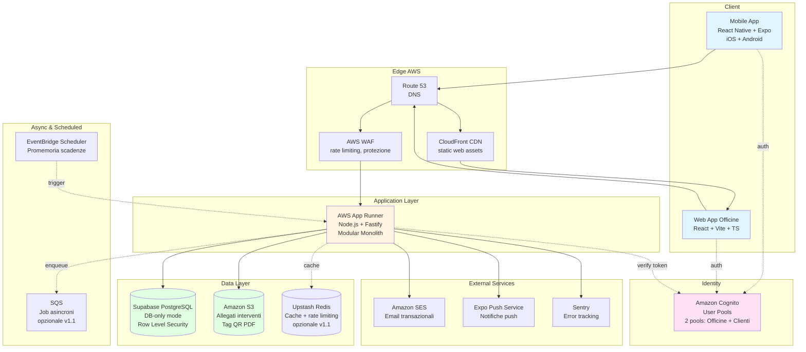

### 5.3 Stack tecnologico completo

#### 5.3.1 Backend

| Componente | Tecnologia | Motivazione |
|---|---|---|
| **Linguaggio** | Node.js 20 LTS + TypeScript 5.x | Ecosystem maturo, uniformità con frontend e mobile, produttività elevata |
| **Framework web** | Fastify | Performance superiori a Express, TypeScript-first, schema validation integrata con JSON Schema |
| **ORM** | Prisma | Type-safety end-to-end, migration system robusto, studio GUI per debug, grande community |
| **Validazione** | Zod | Schema validation type-safe, stesso schema riutilizzabile per OpenAPI e tipi TypeScript |
| **Autenticazione** | Amazon Cognito + JWT | Gestione utenti esternalizzata, token verificabili via JWK, due user pool separati (officine, clienti) |
| **API style** | REST + OpenAPI 3.1 | Specifica auto-generata da schemi Fastify, tooling maturo (Swagger UI, client generators) |
| **Logging** | Pino | Logger ad alte prestazioni standard Fastify, log strutturati JSON per CloudWatch |
| **Testing** | Vitest + Supertest | Test runner veloce, compatibile Jest API, ottimo per TypeScript |

#### 5.3.2 Frontend Web (officine)

| Componente | Tecnologia | Motivazione |
|---|---|---|
| **Framework** | React 18 + TypeScript | Standard di mercato, ecosystem enorme, team disponibili |
| **Build tool** | Vite | Dev server istantaneo, build veloce, zero config |
| **Routing** | React Router v6 | Standard de facto per SPA React |
| **State management** | TanStack Query (server state) + Zustand (client state) | Query gestisce caching/sync API, Zustand per stato UI leggero |
| **UI components** | shadcn/ui + Tailwind CSS | Componenti copiabili, customizzabili, ottima base design system |
| **Form handling** | React Hook Form + Zod | Validazione integrata con schemi backend |
| **Icone** | Lucide Icons | Libreria icone moderne, tree-shakeable |

#### 5.3.3 Mobile app (cliente finale)

| Componente | Tecnologia | Motivazione |
|---|---|---|
| **Framework** | React Native con Expo (managed workflow) | Single codebase iOS+Android, TypeScript, deploy via Expo EAS |
| **Navigation** | Expo Router (file-based routing) | Paradigma moderno, simile a Next.js |
| **State** | TanStack Query + Zustand | Stesso approccio del web, codice condivisibile |
| **Push notifications** | Expo Push Service | Abstrae APNS/FCM, gratuito |
| **Camera/QR** | expo-camera + expo-barcode-scanner | Scansione QR nativa, parte di Expo SDK |
| **Storage locale** | expo-secure-store + AsyncStorage | Token in secure storage, dati cached in async storage |
| **Biometric** | expo-local-authentication | Face ID / Touch ID / Android biometric |
| **Deploy** | EAS Build + EAS Submit | Build cloud + submission automatica agli store |

#### 5.3.4 Database e storage

| Componente | Tecnologia | Motivazione |
|---|---|---|
| **Database primario** | Supabase PostgreSQL (DB-only mode, region EU) | Già incluso nel piano Pro del team, PITR 7 giorni, branching per test, dashboard admin, PostgreSQL 100% compatibile |
| **Migration** | Prisma Migrate | Versioning schema, rollback, diff automatico |
| **Object storage** | Amazon S3 (Frankfurt eu-central-1) | Allegati interventi, PDF generati, tag QR |
| **CDN** | Amazon CloudFront | Distribuzione asset web, caching immagini |
| **Cache** | _Nessuno in v1_ — Upstash Redis in v1.1 se serve | Pilota non necessita di cache dedicato, PostgreSQL + caching in app sufficienti |

#### 5.3.5 Infrastruttura e DevOps

| Componente | Tecnologia | Motivazione |
|---|---|---|
| **Backend hosting** | AWS App Runner (v1), AWS ECS Fargate (v1.1+) | Zero configurazione, deploy da container, auto-scale. Passaggio a ECS quando servono più servizi |
| **DNS** | Amazon Route 53 | Integrato con altri servizi AWS |
| **WAF** | AWS WAF (basic ruleset) | Protezione da attacchi comuni, rate limiting |
| **CI/CD** | GitHub Actions | Free tier 2000 min/mese per repo privati |
| **IaC** | AWS CDK (TypeScript) | Coerente con stack, più produttivo di Terraform per team TS |
| **Environment v1** | Solo production | Supabase branch per test puntuali, staging in v1.1 |
| **Environment v1.1+** | Dev + Staging + Production | Ambienti separati con Supabase branches e App Runner services distinti |

#### 5.3.6 Servizi esterni

| Componente | Tecnologia | Motivazione |
|---|---|---|
| **Email transazionali** | Amazon SES (region EU) | Economico (~1€ per 10k email), integrato con AWS |
| **Push notifications** | Expo Push Service | Gratuito, abstrae APNS/FCM |
| **Error tracking** | Sentry (free tier) | 5000 errori/mese gratis, integrato con Node.js, React, React Native |
| **Logs & metrics** | Amazon CloudWatch | Integrato con App Runner, metriche base incluse |
| **SMS (v1.1)** | _Non incluso in v1_ | Da valutare Twilio o AWS SNS in v1.1 |
| **Stripe** | _Non incluso in v1_ | Integrazione in v1.1 per billing self-service |

### 5.4 Architettura multi-tenant

#### 5.4.1 Modello di isolamento

Si adotta il pattern **shared database, shared schema con tenant_id**:

- Un unico database PostgreSQL contiene i dati di tutti i tenant
- Ogni tabella "business" ha una colonna `tenant_id` che identifica il tenant proprietario
- L'isolamento è garantito a tre livelli: (a) applicativo, (b) Row Level Security PostgreSQL, (c) audit log

**Perché questa scelta:**
- **Costi minimi**: un solo database da gestire e monitorare
- **Query cross-tenant** semplici per analytics e amministrazione
- **Scalabilità**: PostgreSQL gestisce comodamente migliaia di tenant
- **Complessità operativa bassa**: niente sharding manuale, niente gestione di cluster

**Pattern alternativi valutati e scartati per la v1:**
- **Database per tenant**: costi e gestione moltiplicati per N. Sensato solo per enterprise con requisiti di isolamento hard
- **Schema per tenant**: meno costoso del database-per-tenant ma migration complesse, overhead di connessione
- **Silos completi**: fuori scope per un SaaS consumer-oriented

#### 5.4.2 Meccanismi di isolamento

**Livello 1 — Applicativo:**
- Ogni richiesta API risolve il `tenant_id` dal token JWT (Cognito custom attribute)
- Ogni query Prisma applica automaticamente `where: { tenantId }` via middleware
- Impossibile leggere/scrivere dati di altri tenant tramite API

**Livello 2 — Row Level Security PostgreSQL:**
- Policy RLS abilitate su tutte le tabelle tenant-scoped
- La sessione PostgreSQL imposta `SET app.current_tenant = '<tenant_id>'`
- Anche in caso di bug applicativo, il database rifiuta query fuori tenant

**Livello 3 — Audit:**
- Ogni operazione di scrittura logga `user_id + tenant_id + action + timestamp`
- Anomalie (tentativi di accesso cross-tenant) sollevano alert

#### 5.4.3 Distinzione tenant vs entità cross-tenant

Alcune entità sono **cross-tenant** per design:

- **Veicoli** (`vehicles`): un veicolo è visibile a tutte le officine tramite codice/targa/VIN. Non ha `tenant_id`
- **Interventi officina** (`interventions`): hanno `tenant_id` (chi li ha registrati) ma sono visibili a tutti gli altri tenant del circuito tramite il veicolo
- **Clienti finali** (`customers`): hanno associazioni N:N con tenant tramite `customer_tenants` (un cliente può aver avuto interventi presso più officine)
- **Dati personali cliente** (`customer_personal_data`): visibili solo ai tenant con cui il cliente ha una relazione commerciale storicizzata

Questa struttura sarà dettagliata nella Sezione 6 (Modello dati).

### 5.5 Autenticazione e autorizzazione

#### 5.5.1 Amazon Cognito — due User Pool

Si adottano **due User Pool Cognito separati**:

- **Pool Officine**: utenti dei tenant (Super Admin, Meccanico). Attributi custom: `tenantId`, `locationId`, `role`
- **Pool Clienti**: utenti finali che usano l'app mobile. Attributi custom: `customerId`

Motivazione della separazione: flussi di login, policy di password, branding email, requisiti 2FA e MFA possono differire tra i due mondi. Non si "mescolano" identità.

#### 5.5.2 Flusso di autenticazione

1. L'utente si autentica tramite Cognito (login form custom che parla con Cognito API)
2. Cognito restituisce un JWT (ID token + access token)
3. Il client invia il token ad ogni richiesta in header `Authorization: Bearer`
4. Il backend Fastify valida il token tramite JWK pubblico di Cognito
5. Gli attributi custom (`tenantId`, `role`, ecc.) sono estratti dal token senza ulteriori DB lookup

#### 5.5.3 Autorizzazione

- Middleware Fastify verifica ruolo richiesto per ogni endpoint
- Decorator/helper `@requiresRole('super_admin')` e `@requiresTenantAccess()`
- Per azioni su risorse specifiche (es. modifica intervento), controllo esplicito di appartenenza al tenant

#### 5.5.4 Password e sicurezza account

- Policy password minima: 10 caratteri, lettere + numeri
- Reset password via email (flow nativo Cognito)
- 2FA TOTP opzionale (F-OFF-006 COULD per v1)
- Biometric login mobile (F-CLI-002 MUST): token refresh salvato in secure store, sblocco via Face ID/Touch ID

### 5.6 Storage allegati e compressione

#### 5.6.1 Flusso upload

1. Client richiede al backend un **presigned URL** per upload su S3
2. Backend valida: dimensione max, mime type, autorizzazione utente
3. Client uploada direttamente su S3 tramite presigned URL (scarica load dal backend)
4. Backend riceve callback (via S3 event → SNS/SQS in v1.1; in v1 polling o trust client)
5. Lambda di compressione (o worker server-side) ridimensiona immagini (WebP, max 2048px, qualità 85%)
6. Backend registra metadata nel DB

#### 5.6.2 Struttura S3

- Bucket unico `garageos-prod-attachments`
- Struttura: `tenants/<tenant_id>/interventions/<intervention_id>/<uuid>.<ext>`
- Policy: solo l'app backend può scrivere; lettura via presigned URL temporanei (15 minuti)
- Versioning attivo per recupero accidentale
- Lifecycle: transizione a S3 Infrequent Access dopo 90 giorni (risparmio 30-40%)

### 5.7 Notifiche push

#### 5.7.1 Architettura

- Client mobile registra il device token presso Expo Push Service al primo avvio
- Il token viene salvato in `customer_push_tokens` (può essere multiplo per utente su più device)
- Il backend invia notifiche tramite Expo Push API (`https://exp.host/--/api/v2/push/send`)
- Expo Push Service gestisce routing APNS (iOS) / FCM (Android)

#### 5.7.2 Tipi di notifica

| Tipo | Canali v1 | Scheduler | Note |
|---|---|---|---|
| Nuovo intervento registrato | Push + Email | Immediato (on write) | Trigger in transazione intervento |
| Scadenza T-30 giorni | Push + Email | EventBridge Scheduler | Configurato alla creazione scadenza |
| Scadenza T-7 giorni | Push + Email | EventBridge Scheduler | Come sopra |
| Scadenza T-0 (oggi) | Push + Email | EventBridge Scheduler | Come sopra |
| Passaggio di proprietà richiesto | Push + Email | Immediato | |
| Risposta officina a contestazione | Push + Email | Immediato | |
| Codice/link recupero password | Email only | Immediato | Sicurezza |

### 5.8 Scheduler scadenze

Si utilizza **Amazon EventBridge Scheduler** per tutti i job pianificati:

- Alla creazione di una scadenza, il backend registra 3 schedule in EventBridge (T-30, T-7, T-0)
- Ogni schedule è un "one-time schedule" con target HTTP verso l'endpoint `/internal/scheduler/deadline-reminder`
- L'endpoint è protetto con firma HMAC (solo EventBridge può chiamarlo)
- Alla cancellazione della scadenza, gli schedule vengono rimossi

**Perché EventBridge Scheduler vs alternatives:**
- **Cron in app**: non scalabile, fragile, richiede stato interno
- **AWS Lambda con EventBridge Rule**: più complesso, tier gratuito generoso ma serve Lambda
- **SQS con delay**: max 15 minuti di delay, inutilizzabile per promemoria a lungo termine
- **EventBridge Scheduler**: nativo per scheduling, milioni di schedule supportati, pay-per-invocation

### 5.9 API design

#### 5.9.1 Convenzioni REST

- Base URL: `https://api.garageos.it/v1/`
- Risorse pluralizzate: `/v1/vehicles`, `/v1/interventions`
- Azioni non-CRUD in sub-path: `POST /v1/vehicles/:id/certify`, `POST /v1/interventions/:id/dispute`
- Pagination: cursor-based (`?cursor=abc&limit=50`)
- Filtering: query parameters (`?status=active&location_id=xyz`)
- Sorting: `?sort=-created_at` (dash = descending)
- Formato risposte: JSON, envelope `{ data: ..., meta: {...} }` per liste

#### 5.9.2 Versioning

- Versioning via URL path (`/v1/`, `/v2/`)
- Deprecation policy: 12 mesi di supporto parallelo tra versioni maggiori
- Breaking changes SEMPRE in nuova versione
- OpenAPI spec generato automaticamente da schemi Fastify, servito a `/v1/openapi.json` e UI a `/v1/docs`

#### 5.9.3 Sicurezza API

- HTTPS obbligatorio (TLS 1.2+), redirect HTTP→HTTPS
- Rate limiting: 100 req/min per IP (anonimo), 1000 req/min per utente autenticato, 10000 req/min per tenant
- CORS: whitelist esplicita degli origin (`app.garageos.it`, domini custom tenant)
- Content Security Policy severa lato web
- Input validation via Zod su tutti gli endpoint
- Output sanitization per prevenire XSS su campi utente

### 5.10 Sicurezza

#### 5.10.1 Dati in transito

- TLS 1.2+ ovunque
- HSTS abilitato
- Certificate management tramite AWS Certificate Manager (gratis, auto-rinnovo)

#### 5.10.2 Dati a riposo

- PostgreSQL encryption at rest (Supabase built-in)
- S3 encryption (SSE-S3) default
- Secrets in **AWS Secrets Manager** (API keys, webhook signing secrets)
- Environment variables sensibili mai committate (`.env.example` con placeholder, `.env` in `.gitignore`)

#### 5.10.3 GDPR compliance

- **Diritto all'oblio**: endpoint di cancellazione account che: cancella dati anagrafici utente, anonimizza interventi (rimane traccia tecnica ma no PII), invalida tutti i token
- **Portabilità**: endpoint di export dati utente in JSON
- **Data Processing Agreement**: template DPA da firmare con i tenant
- **Privacy by design**: minimizzazione dei dati raccolti, accesso differenziato per ruolo
- **Log accessi**: tracciamento completo di chi accede a cosa (tenant, utente, timestamp, IP)
- **Region hosting**: dati in EU (AWS Frankfurt + Supabase EU)

#### 5.10.4 Rate limiting e DoS

- AWS WAF: regole OWASP managed + regole custom
- Rate limiting app-level via Fastify-rate-limit
- CloudFront gestisce distribuzione geografica e cache asset statici

### 5.11 Osservabilità

#### 5.11.1 Logs

- **Application logs**: Pino structured JSON logs → CloudWatch Logs
- **Livelli**: DEBUG (dev), INFO (prod), WARN, ERROR
- **Log retention**: 30 giorni in CloudWatch (costo controllato); log critici esportati a S3 con lifecycle 1 anno
- **Correlation ID**: ogni request genera un `requestId` propagato in tutti i log correlati

#### 5.11.2 Metriche

- **Infrastrutturali**: CloudWatch native per App Runner (CPU, memoria, request count, latency)
- **Business**: contatori custom (veicoli creati, interventi registrati, claim completati) via CloudWatch Embedded Metric Format
- **Dashboard**: CloudWatch Dashboard con KPI operativi

#### 5.11.3 Error tracking

- **Sentry** integrato lato backend (Node.js SDK), lato web (React SDK), lato mobile (Expo integration)
- Alert automatici su regressioni (nuovi errori, picchi di frequenza)
- Release tracking (associa errore a commit/versione)

#### 5.11.4 Alerting

- **CloudWatch Alarms**: CPU > 80%, errori HTTP 5xx > 1%, latency p99 > 2s
- **Destinazione**: email team (iniziale), PagerDuty/OpsGenie in v1.1

### 5.12 CI/CD

#### 5.12.1 Pipeline v1

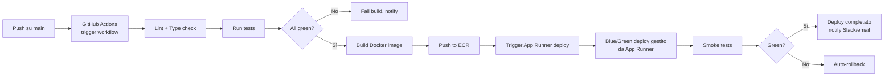

#### 5.12.2 Ambiente v1

- **Un solo ambiente production**
- Supabase branch temporanei per test di feature grosse
- Feature flags lato applicativo per abilitare gradualmente funzionalità (via LaunchDarkly in v1.1 o tabella DB semplice in v1)

#### 5.12.3 Ambienti v1.1

- **Dev**: branch development auto-deployato su istanza App Runner "dev"
- **Staging**: branch staging auto-deployato su istanza "staging", DB Supabase branch dedicato
- **Production**: branch main auto-deployato su istanza "prod"

### 5.13 Stima costi mensili — fase pilota (10-50 officine)

Stime basate su pricing AWS 2026 region eu-central-1 e Supabase pricing corrente. I costi sono in euro, approssimati.

#### 5.13.1 Scenario "pilota basso" (10 officine, 500 veicoli, 200 clienti finali)

| Voce | Costo mese | Note |
|---|---|---|
| **AWS App Runner** | ~25€ | 1 vCPU / 2 GB, traffico basso |
| **Supabase PostgreSQL** | 0€ | Incluso nel piano Pro già attivo (25€/mese fisso, considerato asset esistente del team) |
| **Amazon S3** | ~1€ | <10 GB allegati + richieste |
| **CloudFront** | ~2€ | Cache di asset web |
| **Amazon Cognito** | 0€ | Free tier 50k MAU |
| **Amazon SES** | <1€ | <10k email/mese |
| **EventBridge Scheduler** | <1€ | <1M invocazioni gratis |
| **Route 53** | ~1€ | Hosted zone + query |
| **AWS WAF** | ~5€ | Regole base |
| **CloudWatch Logs + Metrics** | ~3€ | 30 giorni retention |
| **AWS Secrets Manager** | ~1€ | 3-4 secrets (DB credentials, API keys) |
| **Expo EAS** | 0€ | Free tier sufficiente v1 |
| **Expo Push Service** | 0€ | Gratuito |
| **Sentry** | 0€ | Free tier 5k errors |
| **GitHub Actions** | 0€ | Free tier |
| **Dominio** | ~1€ | .it annuale ammortizzato via Route 53 |
| **TOTALE PILOTA BASSO AWS** | **~40€/mese** | |
| **+ Supabase Pro (già esistente)** | 25€ fisso | Considerato costo pre-esistente del team |

#### 5.13.2 Scenario "pilota alto" (50 officine, 3.000 veicoli, 1.500 clienti finali)

| Voce | Costo mese | Note |
|---|---|---|
| **AWS App Runner** | ~40€ | 1 vCPU / 2 GB, traffico moderato |
| **Supabase PostgreSQL** | 0€ | Sempre dentro piano Pro (max 8 GB storage, 8 GB RAM) |
| **Amazon S3** | ~4€ | ~50 GB allegati |
| **CloudFront** | ~5€ | Traffico maggiore |
| **Amazon Cognito** | 0€ | Sempre in free tier |
| **Amazon SES** | ~2€ | ~20k email/mese |
| **EventBridge Scheduler** | <1€ | Sempre in free tier |
| **Route 53** | ~1€ | |
| **AWS WAF** | ~8€ | Più richieste valutate |
| **CloudWatch Logs + Metrics** | ~8€ | Più volume log |
| **AWS Secrets Manager** | ~1€ | |
| **Expo EAS** | ~0-29€ | Free tier sufficiente, piano Pro se serve più build |
| **Expo Push Service** | 0€ | Gratuito |
| **Sentry Team plan** | ~26€ | Se supera 5k errors |
| **GitHub Actions** | 0€ | Free tier |
| **Dominio** | ~1€ | |
| **TOTALE PILOTA ALTO AWS** | **~96-125€/mese** | |
| **+ Supabase Pro (già esistente)** | 25€ fisso | |

#### 5.13.3 Costi in crescita (oltre il pilota, >100 officine)

Quando si supera la scala pilota, tipicamente si attivano:

- **Passaggio a AWS ECS Fargate** o aumento dimensioni App Runner: ~100-200€/mese
- **Amazon RDS PostgreSQL** (t4g.medium Multi-AZ): ~80-120€/mese
- **CloudFront + WAF maggiori**: ~30-50€/mese
- **Sentry Business plan** se serve: ~80€/mese
- **Stripe** per billing self-service: 1,4% + 0,25€ per transazione
- **Aggiunta Upstash Redis** per cache: ~10€/mese

**Proiezione 100-500 tenant**: 400-800€/mese di infrastruttura. Con anche solo €30/mese per tenant pagante, il margine è ampio.

A scale (>500 tenant), valutare migrazione DB da Supabase a Amazon RDS per unificazione AWS e costi più prevedibili.

### 5.14 Strategie di ottimizzazione costi

Alcune tecniche per mantenere i costi bassi:

1. **Scale-to-zero aggressivo**: App Runner scala da 0 istanze in periodi di inattività notturni
2. **Supabase branching per test**: invece di staging always-on, branch temporanei creati/distrutti on-demand (gratis dentro il piano Pro)
3. **S3 Intelligent Tiering** post v1 per allegati con accesso irregolare
4. **CloudFront caching aggressivo** per asset web (TTL lungo, versionamento via hash)
5. **Compressione immagini lato server**: riduce storage S3 dell'80-90%
6. **Log retention breve** (30 giorni): log critici archiviati su S3 lifecycle
7. **Free tier maximization**: Cognito, Expo Push, Sentry, GitHub Actions, Expo EAS restano gratis a lungo
8. **Nessuna ridondanza superflua in v1**: single AZ, single region (Frankfurt)

### 5.15 Roadmap tecnica di evoluzione

**v1 (pilota)** — architettura descritta sopra
**v1.1** (post-pilota, 50-200 tenant):
- Stripe per billing self-service
- Staging ambiente dedicato
- Upstash Redis per cache
- SMS fallback (AWS SNS o Twilio)
- Datadog/Grafana Cloud per metriche avanzate

**v2** (scale, >200 tenant):
- Migrazione App Runner → ECS Fargate
- Supabase → Amazon RDS/Aurora (valutare costi/benefici per unificazione AWS)
- CI/CD multi-ambiente completo (dev/staging/prod)
- Multi-AZ, backup georeplicati
- Event-driven architecture con SQS/SNS/EventBridge
- Possibile split in microservizi mirati (es. servizio notifiche)

### 5.16 Rischi tecnici e mitigazioni

| Rischio | Mitigazione |
|---|---|
| Supabase latency (traffic crosses internet vs VPC) | Monitoring latency, acceptable +5-10ms; se problematico, migrazione a RDS in VPC |
| App Runner limiti scaling (max 200 concurrency) | Monitoring, passaggio a ECS Fargate quando vicini al limite |
| Vendor lock-in Cognito | Flussi auth standard OAuth 2.0, migrazione possibile a Auth0/Clerk con sforzo medio |
| Vendor lock-in Supabase DB | PostgreSQL 100% standard, migrazione a RDS banale con pg_dump/restore |
| Expo Push Service outage | Fallback via APNS/FCM diretto implementabile in ~1 settimana se serve |
| Costi oltre budget | Monitoraggio settimanale con AWS Cost Explorer, alert su soglie |

---

## 6. Modello dati

Questa sezione definisce il modello dati completo del sistema. Le decisioni di modellazione sono coerenti con le decisioni prese in §5 (multi-tenancy shared-schema, PostgreSQL con RLS, Prisma ORM). Il modello è pensato per generare direttamente uno schema Prisma funzionante.

### 6.1 Principi di modellazione

1. **Identificatori**: tutte le entità usano `UUID v7` (time-ordered) come primary key. Permette ordinamento cronologico naturale e inserimenti performanti
2. **Tenant scoping**: ogni entità business ha `tenant_id` se è tenant-scoped, oppure nessun `tenant_id` se è cross-tenant (es. `Vehicle`)
3. **Soft delete**: le entità con storico significativo usano `deleted_at` timestamp invece di cancellazione fisica. Alcune entità (interventi) non ammettono cancellazione affatto
4. **Timestamp standard**: ogni tabella ha `created_at` e `updated_at` gestiti automaticamente
5. **Auditabilità**: le entità critiche hanno tabelle di revisione separate (pattern event-sourcing leggero)
6. **Enum fortemente tipizzati**: stati e tipi modellati come PostgreSQL ENUM + Prisma enum
7. **Row Level Security**: attivo su tutte le tabelle tenant-scoped. Policy basate su `current_setting('app.current_tenant')`

### 6.2 Diagramma ER generale

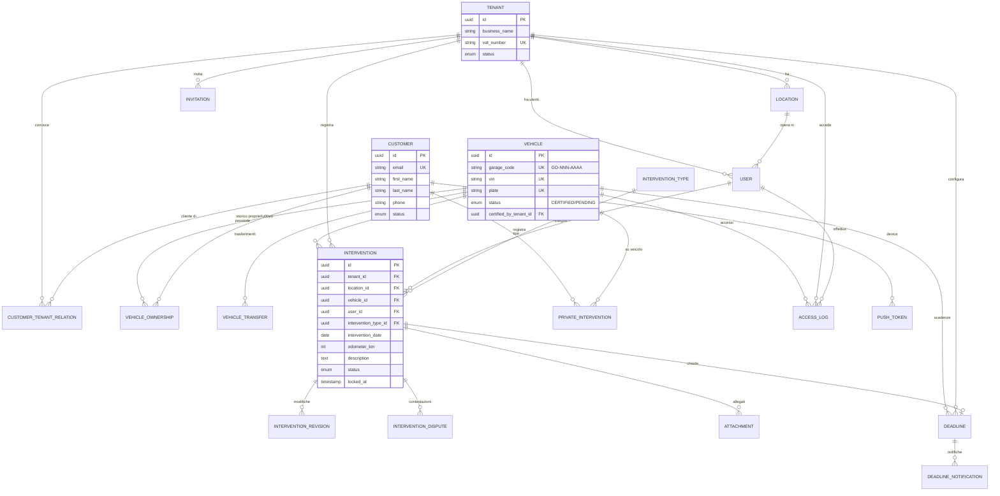

### 6.3 Entità tenant-scoped (multi-tenant)

#### 6.3.1 Tenant

Rappresenta un'officina singola o una catena. Unità di isolamento principale del sistema multi-tenant.

| Campo | Tipo | Vincoli | Note |
|---|---|---|---|
| `id` | UUID v7 | PK | |
| `business_name` | VARCHAR(200) | NOT NULL | Ragione sociale |
| `vat_number` | VARCHAR(20) | UNIQUE, NOT NULL | P.IVA italiana |
| `tax_code` | VARCHAR(20) | NULLABLE | Codice fiscale se diverso da P.IVA |
| `email` | VARCHAR(255) | NOT NULL | Email amministrativa |
| `phone` | VARCHAR(30) | NULLABLE | |
| `address_line` | VARCHAR(255) | NULLABLE | Indirizzo sede legale |
| `city` | VARCHAR(100) | NULLABLE | |
| `province` | VARCHAR(2) | NULLABLE | Sigla provincia IT |
| `postal_code` | VARCHAR(10) | NULLABLE | |
| `logo_url` | VARCHAR(500) | NULLABLE | URL S3 del logo officina |
| `status` | ENUM | NOT NULL, DEFAULT 'active' | `active`, `suspended`, `pending`, `cancelled` |
| `billing_status` | ENUM | NOT NULL, DEFAULT 'manual' | `manual` (v1), `stripe_active`, `stripe_past_due` (v1.1+) |
| `plan` | VARCHAR(50) | NOT NULL, DEFAULT 'starter' | Riferimento al piano sottoscritto |
| `settings` | JSONB | NOT NULL, DEFAULT '{}' | Preferenze officina (es. giorni apertura, categorie servizi) |
| `created_at` | TIMESTAMPTZ | NOT NULL, DEFAULT now() | |
| `updated_at` | TIMESTAMPTZ | NOT NULL | |
| `deleted_at` | TIMESTAMPTZ | NULLABLE | Soft delete |

**Indici:**
- `idx_tenants_vat_number` su `vat_number`
- `idx_tenants_status` su `status` WHERE `deleted_at IS NULL`

#### 6.3.2 Location

Sede fisica di un tenant. Un tenant ha almeno una location (per officine singole è l'unica, per catene sono le sedi).

| Campo | Tipo | Vincoli | Note |
|---|---|---|---|
| `id` | UUID v7 | PK | |
| `tenant_id` | UUID | FK → tenants, NOT NULL | |
| `name` | VARCHAR(150) | NOT NULL | Es. "Sede Milano Centrale" |
| `address_line` | VARCHAR(255) | NOT NULL | |
| `city` | VARCHAR(100) | NOT NULL | |
| `province` | VARCHAR(2) | NOT NULL | |
| `postal_code` | VARCHAR(10) | NOT NULL | |
| `country` | VARCHAR(2) | NOT NULL, DEFAULT 'IT' | ISO 3166-1 alpha-2 |
| `latitude` | DECIMAL(10,7) | NULLABLE | Per mappa futura |
| `longitude` | DECIMAL(10,7) | NULLABLE | |
| `phone` | VARCHAR(30) | NULLABLE | |
| `email` | VARCHAR(255) | NULLABLE | |
| `is_primary` | BOOLEAN | NOT NULL, DEFAULT false | Una sola location primary per tenant |
| `status` | ENUM | NOT NULL, DEFAULT 'active' | `active`, `inactive` |
| `created_at` | TIMESTAMPTZ | NOT NULL | |
| `updated_at` | TIMESTAMPTZ | NOT NULL | |
| `deleted_at` | TIMESTAMPTZ | NULLABLE | |

**Indici:**
- `idx_locations_tenant_id` su `tenant_id`
- `uq_locations_tenant_primary` UNIQUE su `(tenant_id)` WHERE `is_primary = true AND deleted_at IS NULL` (vincolo: una sola primary)

#### 6.3.3 User (utente officina)

Rappresenta un utente di un tenant (Super Admin o Meccanico). Collegato a Cognito tramite `cognito_sub`.

| Campo | Tipo | Vincoli | Note |
|---|---|---|---|
| `id` | UUID v7 | PK | |
| `tenant_id` | UUID | FK → tenants, NOT NULL | |
| `location_id` | UUID | FK → locations, NULLABLE | NULL per Super Admin di catena, specifico per meccanici |
| `cognito_sub` | VARCHAR(100) | UNIQUE, NOT NULL | Subject del JWT Cognito |
| `email` | VARCHAR(255) | NOT NULL | |
| `first_name` | VARCHAR(100) | NOT NULL | |
| `last_name` | VARCHAR(100) | NOT NULL | |
| `role` | ENUM | NOT NULL | `super_admin`, `mechanic` (v1). Estendibile |
| `avatar_url` | VARCHAR(500) | NULLABLE | |
| `phone` | VARCHAR(30) | NULLABLE | |
| `last_login_at` | TIMESTAMPTZ | NULLABLE | |
| `status` | ENUM | NOT NULL, DEFAULT 'active' | `active`, `inactive`, `invited` |
| `created_at` | TIMESTAMPTZ | NOT NULL | |
| `updated_at` | TIMESTAMPTZ | NOT NULL | |
| `deleted_at` | TIMESTAMPTZ | NULLABLE | |

**Indici:**
- `idx_users_tenant_id` su `tenant_id`
- `idx_users_cognito_sub` su `cognito_sub`
- `idx_users_email` su `email`

### 6.4 Entità cliente finale (cross-tenant, B2C)

#### 6.4.1 Customer

Rappresenta un utente finale (proprietario di veicolo). A differenza di User, **non è tenant-scoped**: un customer può avere rapporti con più tenant.

| Campo | Tipo | Vincoli | Note |
|---|---|---|---|
| `id` | UUID v7 | PK | |
| `cognito_sub` | VARCHAR(100) | UNIQUE, NULLABLE | NULL se customer creato da officina senza registrazione app |
| `email` | VARCHAR(255) | UNIQUE, NOT NULL | Chiave di contatto primaria |
| `first_name` | VARCHAR(100) | NOT NULL | |
| `last_name` | VARCHAR(100) | NOT NULL | |
| `phone` | VARCHAR(30) | NULLABLE | |
| `tax_code` | VARCHAR(20) | NULLABLE | Codice fiscale, opzionale |
| `is_business` | BOOLEAN | NOT NULL, DEFAULT false | Cliente aziendale |
| `business_name` | VARCHAR(200) | NULLABLE | Se is_business |
| `vat_number` | VARCHAR(20) | NULLABLE | Se is_business |
| `address_line` | VARCHAR(255) | NULLABLE | |
| `city` | VARCHAR(100) | NULLABLE | |
| `province` | VARCHAR(2) | NULLABLE | |
| `postal_code` | VARCHAR(10) | NULLABLE | |
| `app_installed` | BOOLEAN | NOT NULL, DEFAULT false | True al primo login mobile |
| `notification_preferences` | JSONB | NOT NULL, DEFAULT standard | Preferenze canali notifica |
| `status` | ENUM | NOT NULL, DEFAULT 'active' | `active`, `pending_verification`, `deleted` |
| `created_at` | TIMESTAMPTZ | NOT NULL | |
| `updated_at` | TIMESTAMPTZ | NOT NULL | |
| `deleted_at` | TIMESTAMPTZ | NULLABLE | Soft delete, ma anagrafica anonimizzata al delete |

**Indici:**
- `idx_customers_cognito_sub` su `cognito_sub` WHERE `cognito_sub IS NOT NULL`
- `idx_customers_email` su `email`
- `idx_customers_phone` su `phone` WHERE `phone IS NOT NULL`

**Note privacy:**
- Alla richiesta GDPR di cancellazione: `deleted_at` impostato, `first_name`/`last_name`/`email`/`phone` anonimizzati (es. sostituiti con "Utente cancellato" e email hash)
- Gli interventi privati dell'utente possono essere cancellati
- I veicoli di cui era proprietario NON vengono cancellati ma la `VehicleOwnership` viene chiusa

#### 6.4.2 CustomerTenantRelation

Tabella di associazione N:N tra Customer e Tenant. Rappresenta il fatto che un cliente è conosciuto da un'officina (ha avuto almeno un intervento lì).

**Questa tabella è la chiave della regola di privacy §2.4.2**: un tenant vede i dati personali di un customer solo se esiste una riga in questa tabella tra loro.

| Campo | Tipo | Vincoli | Note |
|---|---|---|---|
| `id` | UUID v7 | PK | |
| `tenant_id` | UUID | FK → tenants, NOT NULL | |
| `customer_id` | UUID | FK → customers, NOT NULL | |
| `first_intervention_at` | TIMESTAMPTZ | NULLABLE | Timestamp del primo contatto |
| `last_intervention_at` | TIMESTAMPTZ | NULLABLE | Ultimo intervento |
| `intervention_count` | INTEGER | NOT NULL, DEFAULT 0 | Denormalizzato per performance |
| `tenant_notes` | TEXT | NULLABLE | Note riservate officina-cliente (F-OFF-206) |
| `created_at` | TIMESTAMPTZ | NOT NULL | |
| `updated_at` | TIMESTAMPTZ | NOT NULL | |

**Indici:**
- `uq_customer_tenant` UNIQUE su `(tenant_id, customer_id)`
- `idx_customer_tenant_customer` su `customer_id`

### 6.5 Entità veicolo (cross-tenant, cuore del sistema)

#### 6.5.1 Vehicle

Entità centrale del sistema. **Non è tenant-scoped**: un veicolo è visibile a tutte le officine del circuito.

| Campo | Tipo | Vincoli | Note |
|---|---|---|---|
| `id` | UUID v7 | PK | |
| `garage_code` | VARCHAR(12) | UNIQUE, NULLABLE | Formato `GO-NNN-AAAA`. NULL per veicoli PENDING |
| `vin` | VARCHAR(17) | UNIQUE, NOT NULL | Telaio — chiave forte di unicità |
| `plate` | VARCHAR(10) | NOT NULL | Targa (non univoca perché può cambiare) |
| `plate_country` | VARCHAR(2) | NOT NULL, DEFAULT 'IT' | |
| `make` | VARCHAR(50) | NOT NULL | Marca (es. "Fiat") |
| `model` | VARCHAR(100) | NOT NULL | Modello (es. "Panda") |
| `version` | VARCHAR(150) | NULLABLE | Versione/allestimento |
| `year` | SMALLINT | NOT NULL | Anno di fabbricazione |
| `registration_date` | DATE | NULLABLE | Data immatricolazione |
| `vehicle_type` | ENUM | NOT NULL | `car`, `motorcycle`, `van`, `truck`, `agricultural` |
| `fuel_type` | ENUM | NOT NULL | `petrol`, `diesel`, `electric`, `hybrid`, `lpg`, `methane`, `hydrogen`, `other` |
| `engine_displacement` | INTEGER | NULLABLE | Cilindrata in cc |
| `power_kw` | INTEGER | NULLABLE | Potenza in kW |
| `color` | VARCHAR(50) | NULLABLE | |
| `status` | ENUM | NOT NULL, DEFAULT 'pending' | `pending`, `certified`, `archived` |
| `certified_by_tenant_id` | UUID | FK → tenants, NULLABLE | Tenant che ha certificato (generato il codice) |
| `certified_at` | TIMESTAMPTZ | NULLABLE | |
| `created_by_tenant_id` | UUID | FK → tenants, NULLABLE | Tenant che ha creato il record (anche se pending) |
| `created_by_customer_id` | UUID | FK → customers, NULLABLE | Customer che ha creato in modalità utente-first |
| `pending_metadata` | JSONB | NULLABLE | Metadata per stato pending (es. URL libretto caricato) |
| `created_at` | TIMESTAMPTZ | NOT NULL | |
| `updated_at` | TIMESTAMPTZ | NOT NULL | |
| `archived_at` | TIMESTAMPTZ | NULLABLE | Se archiviato (veicolo demolito/esportato) |

**Indici critici:**
- `uq_vehicles_vin` UNIQUE su `vin`
- `uq_vehicles_garage_code` UNIQUE su `garage_code` WHERE `garage_code IS NOT NULL`
- `idx_vehicles_plate` su `plate` (non UNIQUE — può essere duplicata dopo ritargatura)
- `idx_vehicles_status` su `status`

**Vincoli CHECK:**
- `garage_code` deve rispettare pattern `^GO-[A-Z0-9]{3}-[A-Z]{4}$` (regex check)
- `status = 'certified'` implica `garage_code IS NOT NULL AND certified_at IS NOT NULL`
- `status = 'pending'` implica `garage_code IS NULL`

**Generazione garage_code:**
- Alfabeto lettere: 22 caratteri (escluse `I`, `O`, `Q`, `U` per ambiguità)
- Alfabeto cifre: 10 caratteri (0-9), esclusi `0` e `1` → 8 caratteri effettivi
- Combinazioni: 8³ × 22⁴ = 512 × 234.256 = ~120 milioni
- Generazione: random secure + check unicità, retry se collisione

#### 6.5.2 VehicleOwnership

Storico delle proprietà di un veicolo. Una riga per ogni "possesso" di un customer su un veicolo.

| Campo | Tipo | Vincoli | Note |
|---|---|---|---|
| `id` | UUID v7 | PK | |
| `vehicle_id` | UUID | FK → vehicles, NOT NULL | |
| `customer_id` | UUID | FK → customers, NOT NULL | |
| `started_at` | TIMESTAMPTZ | NOT NULL | Inizio proprietà |
| `ended_at` | TIMESTAMPTZ | NULLABLE | Fine proprietà (NULL = attiva) |
| `transfer_reason` | ENUM | NULLABLE | `purchase`, `inheritance`, `company_assignment`, `other` |
| `transfer_notes` | TEXT | NULLABLE | Note opzionali |
| `created_at` | TIMESTAMPTZ | NOT NULL | |

**Indici:**
- `idx_ownership_vehicle_id` su `vehicle_id`
- `idx_ownership_customer_id` su `customer_id`
- `idx_ownership_vehicle_active` UNIQUE su `vehicle_id` WHERE `ended_at IS NULL` (un solo proprietario attivo)

**Vincoli:**
- Per ogni `vehicle_id`, al massimo una riga con `ended_at IS NULL`

#### 6.5.3 VehicleTransfer

Transizione di proprietà **in corso** (non ancora completata). Una volta completata, genera una nuova `VehicleOwnership`.

| Campo | Tipo | Vincoli | Note |
|---|---|---|---|
| `id` | UUID v7 | PK | |
| `vehicle_id` | UUID | FK → vehicles, NOT NULL | |
| `from_customer_id` | UUID | FK → customers, NULLABLE | NULL se claim autonomo senza cedente |
| `to_customer_id` | UUID | FK → customers, NULLABLE | NULL se codice generato prima del cessionario |
| `transfer_code` | VARCHAR(20) | UNIQUE, NULLABLE | Codice temporaneo condiviso fisicamente |
| `invited_email` | VARCHAR(255) | NULLABLE | Se invito via email |
| `method` | ENUM | NOT NULL | `initiated_by_seller`, `claim_without_seller` |
| `status` | ENUM | NOT NULL | `pending_recipient`, `pending_seller_confirmation`, `pending_validation`, `completed`, `rejected`, `expired` |
| `document_url` | VARCHAR(500) | NULLABLE | URL libretto caricato (claim autonomo) |
| `expires_at` | TIMESTAMPTZ | NOT NULL | Scadenza (default 7 giorni) |
| `completed_at` | TIMESTAMPTZ | NULLABLE | |
| `rejected_reason` | TEXT | NULLABLE | Motivazione rifiuto |
| `created_at` | TIMESTAMPTZ | NOT NULL | |
| `updated_at` | TIMESTAMPTZ | NOT NULL | |

**Indici:**
- `idx_transfer_vehicle_id` su `vehicle_id`
- `idx_transfer_status` su `status`
- `uq_transfer_code` UNIQUE su `transfer_code` WHERE `transfer_code IS NOT NULL`

### 6.6 Entità interventi

#### 6.6.1 InterventionType

Catalogo dei tipi di intervento. Alcuni sono "di sistema" (standard), altri possono essere creati dal tenant.

| Campo | Tipo | Vincoli | Note |
|---|---|---|---|
| `id` | UUID v7 | PK | |
| `tenant_id` | UUID | FK → tenants, NULLABLE | NULL = tipo di sistema, visibile a tutti |
| `code` | VARCHAR(50) | NOT NULL | Es. `TAGLIANDO`, `CAMBIO_GOMME`, `REVISIONE` |
| `name_it` | VARCHAR(150) | NOT NULL | Nome localizzato in italiano |
| `description` | TEXT | NULLABLE | |
| `icon` | VARCHAR(50) | NULLABLE | Nome icona (Lucide) |
| `category` | ENUM | NOT NULL | `maintenance`, `repair`, `tires`, `body`, `inspection`, `other` |
| `suggests_deadline` | BOOLEAN | NOT NULL, DEFAULT false | Se true, suggerisce scadenza successiva al completamento |
| `default_deadline_months` | SMALLINT | NULLABLE | Es. 12 per tagliando |
| `default_deadline_km` | INTEGER | NULLABLE | Es. 15000 per tagliando |
| `active` | BOOLEAN | NOT NULL, DEFAULT true | |
| `created_at` | TIMESTAMPTZ | NOT NULL | |
| `updated_at` | TIMESTAMPTZ | NOT NULL | |

**Indici:**
- `uq_intervention_type_code_tenant` UNIQUE su `(tenant_id, code)` (con NULL=system per tipi di sistema)

**Seed iniziale (tipi di sistema):**
- `TAGLIANDO` — Tagliando periodico (suggerisce 12 mesi / 15.000 km)
- `CAMBIO_OLIO` — Cambio olio (12 mesi / 15.000 km)
- `CAMBIO_GOMME_STAGIONE` — Cambio gomme stagionale (6 mesi)
- `CAMBIO_GOMME_USURA` — Cambio gomme per usura (nessuna scadenza auto)
- `DISTRIBUZIONE` — Sostituzione cinghia distribuzione (120.000 km)
- `FRENI` — Intervento sistema frenante
- `REVISIONE` — Revisione ministeriale (24 mesi)
- `CARROZZERIA` — Intervento carrozzeria
- `DIAGNOSI` — Diagnosi elettronica
- `ALTRO` — Altro intervento

#### 6.6.2 Intervention

Intervento registrato da un'officina. **Entità core del sistema**.

| Campo | Tipo | Vincoli | Note |
|---|---|---|---|
| `id` | UUID v7 | PK | |
| `tenant_id` | UUID | FK → tenants, NOT NULL | Officina che ha registrato |
| `location_id` | UUID | FK → locations, NOT NULL | Sede specifica |
| `user_id` | UUID | FK → users, NOT NULL | Meccanico che ha registrato |
| `vehicle_id` | UUID | FK → vehicles, NOT NULL | |
| `intervention_type_id` | UUID | FK → intervention_types, NOT NULL | |
| `intervention_date` | DATE | NOT NULL | Data di esecuzione (immutabile post-creazione) |
| `odometer_km` | INTEGER | NOT NULL | Km al momento dell'intervento (immutabile) |
| `title` | VARCHAR(200) | NULLABLE | Titolo breve opzionale |
| `description` | TEXT | NOT NULL | Descrizione operazioni |
| `parts_replaced` | JSONB | NOT NULL, DEFAULT '[]' | Array di pezzi sostituiti: `[{name, code, quantity, notes}]` |
| `internal_notes` | TEXT | NULLABLE | Note visibili solo al tenant (non al cliente) |
| `status` | ENUM | NOT NULL, DEFAULT 'active' | `active`, `disputed`, `cancelled` |
| `cancelled_reason` | TEXT | NULLABLE | Se status = cancelled |
| `cancelled_by_user_id` | UUID | FK → users, NULLABLE | |
| `cancelled_at` | TIMESTAMPTZ | NULLABLE | |
| `first_seen_by_customer_at` | TIMESTAMPTZ | NULLABLE | Quando il cliente ha visto l'intervento la prima volta |
| `wiki_locked_at` | TIMESTAMPTZ | NULLABLE | Momento di chiusura finestra wiki (48h o prima visualizzazione) |
| `created_at` | TIMESTAMPTZ | NOT NULL | |
| `updated_at` | TIMESTAMPTZ | NOT NULL | |

**Indici:**
- `idx_interventions_tenant_id` su `tenant_id`
- `idx_interventions_vehicle_id` su `vehicle_id`
- `idx_interventions_vehicle_date` su `(vehicle_id, intervention_date DESC)` — per timeline veicolo
- `idx_interventions_status` su `status`

**Business rules (applicate a livello app):**
- Dopo `wiki_locked_at`, le modifiche generano righe in `intervention_revisions`
- `intervention_date`, `odometer_km`, `vehicle_id` sono **sempre immutabili** dopo la creazione (per correggerli si annulla e si crea nuovo intervento)
- Cancellazione fisica vietata — solo `status = 'cancelled'` con motivazione

#### 6.6.3 InterventionRevision

Storico delle modifiche a un intervento (pattern event-sourcing leggero). Popolato automaticamente alle modifiche post-lock.

| Campo | Tipo | Vincoli | Note |
|---|---|---|---|
| `id` | UUID v7 | PK | |
| `intervention_id` | UUID | FK → interventions, NOT NULL | |
| `user_id` | UUID | FK → users, NOT NULL | Chi ha modificato |
| `revised_at` | TIMESTAMPTZ | NOT NULL | |
| `changes` | JSONB | NOT NULL | `{field: {old, new}}` per ogni campo modificato |
| `reason` | TEXT | NULLABLE | Motivazione modifica |

**Indici:**
- `idx_revisions_intervention` su `intervention_id`

#### 6.6.4 InterventionDispute

Contestazione di un intervento da parte del proprietario del veicolo.

| Campo | Tipo | Vincoli | Note |
|---|---|---|---|
| `id` | UUID v7 | PK | |
| `intervention_id` | UUID | FK → interventions, NOT NULL | |
| `customer_id` | UUID | FK → customers, NOT NULL | |
| `reason_category` | ENUM | NOT NULL | `not_performed`, `wrong_data`, `not_authorized`, `overcharge`, `other` |
| `customer_description` | TEXT | NOT NULL | Motivazione cliente |
| `tenant_response` | TEXT | NULLABLE | Risposta officina |
| `tenant_response_at` | TIMESTAMPTZ | NULLABLE | |
| `tenant_response_user_id` | UUID | FK → users, NULLABLE | |
| `status` | ENUM | NOT NULL | `open`, `responded`, `resolved_by_cancellation`, `escalated` |
| `resolved_at` | TIMESTAMPTZ | NULLABLE | |
| `created_at` | TIMESTAMPTZ | NOT NULL | |
| `updated_at` | TIMESTAMPTZ | NOT NULL | |

**Indici:**
- `idx_disputes_intervention` su `intervention_id`
- `idx_disputes_customer` su `customer_id`
- `idx_disputes_status` su `status`

#### 6.6.5 PrivateIntervention

Intervento registrato dal customer nella sua area privata. **Separato** da `Intervention` per semantica e privacy.

| Campo | Tipo | Vincoli | Note |
|---|---|---|---|
| `id` | UUID v7 | PK | |
| `customer_id` | UUID | FK → customers, NOT NULL | Owner dell'intervento privato |
| `vehicle_id` | UUID | FK → vehicles, NOT NULL | |
| `intervention_type_id` | UUID | FK → intervention_types, NULLABLE | Può essere libero |
| `custom_type` | VARCHAR(150) | NULLABLE | Tipo custom se intervention_type_id NULL |
| `intervention_date` | DATE | NOT NULL | |
| `odometer_km` | INTEGER | NULLABLE | Opzionale per interventi privati |
| `description` | TEXT | NOT NULL | |
| `created_at` | TIMESTAMPTZ | NOT NULL | |
| `updated_at` | TIMESTAMPTZ | NOT NULL | |
| `deleted_at` | TIMESTAMPTZ | NULLABLE | Soft delete |

**Indici:**
- `idx_private_int_customer_vehicle` su `(customer_id, vehicle_id, intervention_date DESC)`

**Note:**
- Non è tenant-scoped perché è area personale del customer
- Al passaggio di proprietà, restano legati al customer originario (NON visibili al nuovo proprietario)

### 6.7 Allegati

#### 6.7.1 Attachment

Tabella generica per allegati. Può essere legata a `Intervention` o `PrivateIntervention` via polymorphic pattern.

| Campo | Tipo | Vincoli | Note |
|---|---|---|---|
| `id` | UUID v7 | PK | |
| `owner_type` | ENUM | NOT NULL | `intervention`, `private_intervention` |
| `owner_id` | UUID | NOT NULL | ID dell'entità owner |
| `tenant_id` | UUID | FK → tenants, NULLABLE | Solo se owner_type = intervention |
| `customer_id` | UUID | FK → customers, NULLABLE | Solo se owner_type = private_intervention |
| `uploaded_by_user_id` | UUID | FK → users, NULLABLE | |
| `uploaded_by_customer_id` | UUID | FK → customers, NULLABLE | |
| `file_name` | VARCHAR(255) | NOT NULL | Nome originale |
| `mime_type` | VARCHAR(100) | NOT NULL | |
| `size_bytes` | INTEGER | NOT NULL | |
| `s3_key` | VARCHAR(500) | NOT NULL | Path in S3 |
| `s3_bucket` | VARCHAR(100) | NOT NULL | |
| `processed` | BOOLEAN | NOT NULL, DEFAULT false | True dopo compressione server-side |
| `thumbnail_s3_key` | VARCHAR(500) | NULLABLE | Thumbnail per immagini |
| `created_at` | TIMESTAMPTZ | NOT NULL | |
| `deleted_at` | TIMESTAMPTZ | NULLABLE | Soft delete (file su S3 cancellato via job) |

**Indici:**
- `idx_attachments_owner` su `(owner_type, owner_id)`
- `idx_attachments_tenant` su `tenant_id` WHERE `tenant_id IS NOT NULL`

**Vincoli CHECK:**
- `size_bytes <= 10485760` (10 MB max)
- XOR logico: `tenant_id` o `customer_id` presente in base a `owner_type`

### 6.8 Scadenze e notifiche

#### 6.8.1 Deadline

Scadenza configurata da un'officina per un veicolo.

| Campo | Tipo | Vincoli | Note |
|---|---|---|---|
| `id` | UUID v7 | PK | |
| `tenant_id` | UUID | FK → tenants, NOT NULL | Chi ha configurato |
| `location_id` | UUID | FK → locations, NOT NULL | |
| `vehicle_id` | UUID | FK → vehicles, NOT NULL | |
| `intervention_type_id` | UUID | FK → intervention_types, NOT NULL | Tipo di scadenza (tagliando, revisione…) |
| `source_intervention_id` | UUID | FK → interventions, NULLABLE | Intervento che ha generato la scadenza |
| `due_date` | DATE | NULLABLE | Scadenza per data |
| `due_odometer_km` | INTEGER | NULLABLE | Scadenza per km |
| `description` | TEXT | NULLABLE | Note |
| `is_recurring` | BOOLEAN | NOT NULL, DEFAULT false | Se ricorrente (es. tagliando annuale) |
| `recurring_months` | SMALLINT | NULLABLE | |
| `recurring_km` | INTEGER | NULLABLE | |
| `status` | ENUM | NOT NULL, DEFAULT 'open' | `open`, `completed`, `overdue`, `cancelled` |
| `completed_by_intervention_id` | UUID | FK → interventions, NULLABLE | |
| `completed_at` | TIMESTAMPTZ | NULLABLE | |
| `created_at` | TIMESTAMPTZ | NOT NULL | |
| `updated_at` | TIMESTAMPTZ | NOT NULL | |

**Indici:**
- `idx_deadlines_vehicle` su `vehicle_id`
- `idx_deadlines_tenant_status_date` su `(tenant_id, status, due_date)`
- `idx_deadlines_due_date_open` su `due_date` WHERE `status = 'open'`

**Vincoli:**
- Almeno uno tra `due_date` e `due_odometer_km` deve essere presente

#### 6.8.2 DeadlineNotification

Tracciamento delle notifiche generate per una scadenza (una riga per ogni reminder T-30, T-7, T-0).

| Campo | Tipo | Vincoli | Note |
|---|---|---|---|
| `id` | UUID v7 | PK | |
| `deadline_id` | UUID | FK → deadlines, NOT NULL | |
| `scheduled_for` | TIMESTAMPTZ | NOT NULL | Quando deve partire |
| `reminder_type` | ENUM | NOT NULL | `t_minus_30`, `t_minus_7`, `t_zero` |
| `eventbridge_schedule_arn` | VARCHAR(500) | NULLABLE | ARN dello schedule EventBridge |
| `sent_at` | TIMESTAMPTZ | NULLABLE | Quando effettivamente inviata |
| `delivery_status` | ENUM | NOT NULL, DEFAULT 'pending' | `pending`, `sent`, `failed`, `cancelled` |
| `failure_reason` | TEXT | NULLABLE | |
| `created_at` | TIMESTAMPTZ | NOT NULL | |

**Indici:**
- `idx_dln_deadline` su `deadline_id`
- `idx_dln_scheduled_pending` su `scheduled_for` WHERE `delivery_status = 'pending'`

### 6.9 Audit e tracciamento

#### 6.9.1 AccessLog

Log degli accessi alla scheda di un veicolo da parte di un tenant. Alimenta l'audit trasparente per il customer.

| Campo | Tipo | Vincoli | Note |
|---|---|---|---|
| `id` | UUID v7 | PK | |
| `vehicle_id` | UUID | FK → vehicles, NOT NULL | |
| `tenant_id` | UUID | FK → tenants, NOT NULL | |
| `location_id` | UUID | FK → locations, NULLABLE | |
| `user_id` | UUID | FK → users, NOT NULL | |
| `action` | ENUM | NOT NULL | `view`, `create`, `update`, `search_match` |
| `ip_address` | INET | NULLABLE | |
| `user_agent` | VARCHAR(500) | NULLABLE | |
| `created_at` | TIMESTAMPTZ | NOT NULL | |

**Indici:**
- `idx_access_log_vehicle` su `(vehicle_id, created_at DESC)` — per mostrare al customer
- `idx_access_log_tenant` su `(tenant_id, created_at DESC)` — per audit interno tenant
- Partitioning by range su `created_at` in futuro se cresce molto

**Note:**
- Questa tabella cresce rapidamente — considerare retention 12 mesi e archiviazione su S3

#### 6.9.2 AuditLog (opzionale, SHOULD v1)

Log generico di operazioni sensibili su qualsiasi entità (oltre gli accessi veicoli). Pattern append-only.

| Campo | Tipo | Vincoli | Note |
|---|---|---|---|
| `id` | UUID v7 | PK | |
| `tenant_id` | UUID | FK → tenants, NULLABLE | |
| `actor_type` | ENUM | NOT NULL | `user`, `customer`, `system`, `admin` |
| `actor_id` | UUID | NULLABLE | |
| `action` | VARCHAR(100) | NOT NULL | Es. `intervention.create`, `vehicle.certify` |
| `entity_type` | VARCHAR(100) | NOT NULL | Es. `intervention` |
| `entity_id` | UUID | NOT NULL | |
| `metadata` | JSONB | NOT NULL, DEFAULT '{}' | Dati contestuali |
| `ip_address` | INET | NULLABLE | |
| `created_at` | TIMESTAMPTZ | NOT NULL | |

**Indici:**
- `idx_audit_tenant_date` su `(tenant_id, created_at DESC)` WHERE `tenant_id IS NOT NULL`
- `idx_audit_entity` su `(entity_type, entity_id)`

### 6.10 Inviti e token

#### 6.10.1 Invitation

Inviti generati dalle officine per i customer (post censimento veicolo) o per gli utenti interni (nuovi meccanici del tenant).

| Campo | Tipo | Vincoli | Note |
|---|---|---|---|
| `id` | UUID v7 | PK | |
| `tenant_id` | UUID | FK → tenants, NOT NULL | |
| `invitation_type` | ENUM | NOT NULL | `customer_app`, `internal_user` |
| `target_email` | VARCHAR(255) | NOT NULL | |
| `target_phone` | VARCHAR(30) | NULLABLE | |
| `vehicle_id` | UUID | FK → vehicles, NULLABLE | Solo per customer_app |
| `customer_id` | UUID | FK → customers, NULLABLE | Customer creato (se già esistente) |
| `role` | ENUM | NULLABLE | Per internal_user |
| `location_id` | UUID | FK → locations, NULLABLE | Per internal_user |
| `token` | VARCHAR(100) | UNIQUE, NOT NULL | Token random sicuro nel link |
| `expires_at` | TIMESTAMPTZ | NOT NULL | |
| `accepted_at` | TIMESTAMPTZ | NULLABLE | |
| `created_at` | TIMESTAMPTZ | NOT NULL | |

**Indici:**
- `uq_invitation_token` UNIQUE su `token`
- `idx_invitation_expires` su `expires_at` WHERE `accepted_at IS NULL`

#### 6.10.2 PushToken

Token Expo Push associati ai device dei customer.

| Campo | Tipo | Vincoli | Note |
|---|---|---|---|
| `id` | UUID v7 | PK | |
| `customer_id` | UUID | FK → customers, NOT NULL | |
| `expo_push_token` | VARCHAR(200) | UNIQUE, NOT NULL | |
| `platform` | ENUM | NOT NULL | `ios`, `android` |
| `device_name` | VARCHAR(100) | NULLABLE | |
| `app_version` | VARCHAR(20) | NULLABLE | |
| `last_used_at` | TIMESTAMPTZ | NOT NULL | |
| `active` | BOOLEAN | NOT NULL, DEFAULT true | |
| `created_at` | TIMESTAMPTZ | NOT NULL | |

**Indici:**
- `idx_push_customer_active` su `customer_id` WHERE `active = true`
- `uq_push_token` UNIQUE su `expo_push_token`

### 6.11 Row Level Security — policy principali

Tutte le tabelle tenant-scoped hanno RLS abilitate. Policy standard:

```sql
-- Esempio per tabella interventions
ALTER TABLE interventions ENABLE ROW LEVEL SECURITY;

-- Policy per operazioni scrittura: solo tenant proprietario
CREATE POLICY interventions_write ON interventions
    FOR INSERT, UPDATE, DELETE
    USING (tenant_id = current_setting('app.current_tenant')::uuid);

-- Policy per lettura: tenant proprietario vede tutto,
-- altri tenant vedono solo interventi di veicoli a cui hanno accesso
CREATE POLICY interventions_read_own_tenant ON interventions
    FOR SELECT
    USING (tenant_id = current_setting('app.current_tenant')::uuid);

CREATE POLICY interventions_read_cross_tenant ON interventions
    FOR SELECT
    USING (
        current_setting('app.current_role') = 'admin'
        OR vehicle_id IN (
            SELECT id FROM vehicles WHERE status = 'certified'
        )
    );
```

**Configurazione a livello connessione Prisma:**
- Middleware Prisma esegue `SET LOCAL app.current_tenant = '<id>'` all'inizio di ogni transazione
- Connessione admin (per job scheduler) usa `app.current_role = 'admin'` per bypassare RLS

### 6.12 Indici ricorrenti e performance

**Indici comuni presenti su tutte le tabelle tenant-scoped:**
- `(tenant_id)` — filtro base RLS
- `(tenant_id, created_at DESC)` — liste ordinate cronologicamente
- `(tenant_id, status)` — filtri per stato

**Pattern di performance:**
- Partizionamento per data su tabelle grandi (AccessLog, AuditLog) in v2
- Read replicas per query analitiche pesanti (roadmap)
- Materialized views per dashboard/reportistica (se necessario)
- Full-text search su `vehicles` tramite `pg_trgm` per ricerca targa/VIN/marca (`idx_vehicles_search`)

### 6.13 Dati di seed iniziali

Al primo deploy, popolamento tabelle di configurazione:

- `intervention_types` — tipi di sistema (vedi §6.6.1)
- Nessun tenant demo in production (creati solo via flusso onboarding)

### 6.14 Migrations e versionamento schema

- Gestione con **Prisma Migrate**
- Nomenclatura: `YYYYMMDDHHMMSS_descrizione_snake_case.sql`
- Migration forward-only in produzione (no rollback diretto, sempre migration correttiva)
- Backup DB sempre prima di migrazione significativa
- Breaking schema changes coordinati con deploy applicativo (pattern: expand → migrate → contract)

### 6.15 Dimensionamento stimato (pilota)

| Tabella | Righe stimate @ 50 tenant | Crescita/anno |
|---|---|---|
| `tenants` | 50 | +100% primo anno |
| `locations` | ~70 | +100% |
| `users` | ~200 | +150% |
| `customers` | ~3.000 | +100-200% |
| `vehicles` | ~5.000 | +100-150% |
| `interventions` | ~30.000 | +200% |
| `deadlines` | ~20.000 | +200% |
| `access_logs` | ~200.000 | +300% (va partizionato in v2) |
| `attachments` | ~50.000 | +200% |

**Storage stimato database @ fine pilota:** ~500 MB - 1.5 GB. Ampiamente dentro i limiti del piano Supabase Pro (8 GB storage).

---

## 7. API & Interfacce

Questa sezione descrive l'architettura generale delle API e riferimento alla documentazione di dettaglio.

**Documento di riferimento:** il dettaglio completo degli endpoint è nell'**Appendice A — API Reference** (`APPENDICE_A_API.md`).

### 7.1 Architettura API

Il backend espone un'unica API REST su `https://api.garageos.it/v1/` che serve sia la web app officine che la mobile app cliente. Non c'è separazione di endpoint per canale: lo stesso endpoint risponde sia a chiamate da browser web che da app mobile, con autorizzazione basata sul ruolo estratto dal JWT.

**Stack tecnico API:**
- Framework: Fastify + TypeScript
- Validazione: Zod (schemi condivisi con OpenAPI generation)
- Specifica: OpenAPI 3.1 auto-generata, servita a `/v1/openapi.json`
- Documentazione interattiva: Swagger UI a `/v1/docs` (solo in ambiente dev/staging)

### 7.2 Principi di design API

1. **REST canonico**: risorse pluralizzate, verbi HTTP semantici, status code standard
2. **Azioni non-CRUD in sub-path**: `POST /vehicles/:id/certify`, `POST /interventions/:id/dispute`
3. **Idempotenza**: tutte le operazioni `PUT`/`DELETE` sono idempotenti; operazioni `POST` critiche (pagamenti futuri, invii email) accettano `Idempotency-Key` in header
4. **Pagination consistente**: cursor-based su tutte le liste (`?cursor=...&limit=50`)
5. **Filtering uniforme**: query parameter con sintassi `field=value`, operatori speciali con prefisso (`created_at_gte=2024-01-01`)
6. **Response envelope**: liste sotto `{ data: [...], meta: { cursor, has_more, total } }`, risorse singole dirette
7. **Errori standardizzati**: formato RFC 7807 Problem Details

### 7.3 Autenticazione

Tutti gli endpoint (eccetto quelli pubblici espliciti) richiedono JWT Bearer Token Cognito:

```
Authorization: Bearer eyJraWQ...
```

Il token contiene i claim:
- `sub`: Cognito user ID
- `tenant_id`: (per pool officine) ID del tenant
- `role`: (per pool officine) `super_admin` | `mechanic`
- `customer_id`: (per pool clienti) ID del customer
- `email`: email utente

### 7.4 Raggruppamento endpoint

Gli endpoint sono organizzati in **12 gruppi logici**:

| Gruppo | Prefisso | Descrizione |
|---|---|---|
| Auth & Session | `/auth/*` | Session management, password reset, token refresh |
| Tenants | `/tenants/*` | Gestione tenant, location, preferenze |
| Users (officina) | `/users/*` | Gestione utenti officina, inviti |
| Customers | `/customers/*` | Anagrafica clienti finali lato officina |
| Vehicles | `/vehicles/*` | Ricerca, censimento, certificazione veicoli |
| Interventions | `/interventions/*` | Creazione, modifica, contestazione interventi |
| Private Interventions | `/me/vehicles/:id/private-interventions/*` | Interventi privati lato cliente finale |
| Deadlines | `/deadlines/*` | Scadenze, promemoria |
| Attachments | `/attachments/*` | Upload, download allegati |
| Transfers | `/transfers/*` | Passaggio di proprietà |
| Notifications | `/me/notifications/*` | Notifiche lato cliente finale |
| Admin | `/admin/*` | Endpoint amministrativi team GarageOS |

### 7.5 Endpoint pubblici (no auth)

Alcuni endpoint sono pubblici per supportare flussi senza login:

| Endpoint | Scopo |
|---|---|
| `POST /auth/signup` | Registrazione nuovo utente (officina o cliente) |
| `POST /auth/password-reset-request` | Richiesta reset password |
| `GET /invitations/:token` | Visualizzazione dettagli invito prima di accettarlo |
| `GET /public/vehicles/:share_token` | Vista storico condiviso (link temporaneo, F-CLI-502) |
| `GET /health` | Health check per load balancer |

### 7.6 Rate limiting

Limiti applicati a livello applicativo (Fastify-rate-limit) e WAF:

| Categoria | Limite | Note |
|---|---|---|
| Utente non autenticato (per IP) | 100 req/min | |
| Utente autenticato | 1000 req/min | Per token |
| Tenant (aggregato) | 10000 req/min | Protezione burst multi-user |
| Endpoint auth/signup | 10 req/ora | Per IP, anti-abuse |
| Endpoint upload | 30 req/min | Per utente |

### 7.7 Gestione errori

Formato standard risposta errore (RFC 7807 Problem Details):

```json
{
  "type": "https://api.garageos.it/errors/validation-failed",
  "title": "Validation failed",
  "status": 400,
  "detail": "Campo 'email' non valido",
  "instance": "/v1/customers",
  "errors": [
    { "field": "email", "code": "invalid_format", "message": "Formato email non valido" }
  ],
  "request_id": "req_01HJ8K..."
}
```

**Codici status code utilizzati:**
- `200 OK` — lettura/operazione con payload
- `201 Created` — creazione risorsa
- `204 No Content` — operazione senza payload (delete)
- `400 Bad Request` — validation error
- `401 Unauthorized` — token mancante/scaduto
- `403 Forbidden` — non autorizzato a risorsa/operazione
- `404 Not Found` — risorsa inesistente
- `409 Conflict` — conflitto (es. duplicato, stato incompatibile)
- `422 Unprocessable Entity` — business rule violation
- `429 Too Many Requests` — rate limit
- `500 Internal Server Error` — errore non gestito

### 7.8 Versionamento e compatibilità

- Versioning via URL path (`/v1/`)
- Deprecation: campi obsoleti mantenuti per 12 mesi con header `Deprecation: true` e `Sunset: <date>`
- Breaking changes: solo in nuova versione maggiore (`/v2/`)
- Additive changes (nuovi campi, nuovi endpoint): non rompono contract, vanno in v1 stessa

### 7.9 OpenAPI e client generation

- OpenAPI 3.1 spec disponibile a `/v1/openapi.json`
- Client TypeScript auto-generato con `openapi-typescript-codegen`
- SDK consumato sia da web app che da mobile app (stesso package npm interno)
- Esportazione Postman collection per team di supporto/sviluppo

### 7.10 Webhook (futuro)

In v1 non sono previsti webhook verso sistemi esterni. In v2 si valuterà:
- Webhook per integrazione con gestionali officina esistenti
- Webhook verso Stripe per billing
- Webhook per integrazione flotte aziendali

### 7.11 Riferimento completo endpoint

**→ Vedi `APPENDICE_A_API.md` per il dettaglio completo** di tutti gli endpoint con:
- Signature HTTP completa (metodo + path + auth required)
- Request body schema (Zod/JSON Schema)
- Response body schema
- Esempi di request/response
- Codici errore specifici per endpoint
- Riferimento alle funzionalità F-XXX-YYY della Sezione 3

---

## 8. Design & UI

Questa sezione definisce il design system e presenta i mockup visivi delle principali schermate del sistema. Contiene sia i principi UX guida che i riferimenti visivi concreti da cui Claude Code potrà derivare le schermate restanti.

**Artifact di riferimento:**
- `garageos-officina-design.jsx` — Design System + 3 schermate Web Officina
- `garageos-cliente-design.jsx` — 3 schermate Mobile App Cliente

### 8.1 Strategia di design: ibrida

GarageOS adotta **due direzioni di stile distinte** per i due lati del sistema, riflettendo le diverse personas e contesti d'uso:

**Lato officina (web app) — "tecnico/professionale":**
- Densità informativa alta (meccanico vuole vedere molti dati in un colpo d'occhio sul monitor desktop)
- Layout a griglia ortogonale, card squadrate con border-radius contenuto (12px)
- Palette chiara (bianco + slate) con accenti blu per azioni
- Font monospace per codici tecnici (VIN, targhe, codici GarageOS)
- Badge e stati visivi standardizzati per velocità di lettura

**Lato cliente finale (mobile app) — "friendly/consumer":**
- Respiro visivo, focus su uno o due elementi per schermata
- Card con border-radius ampio (24px-32px), gradienti e ombre morbide
- Carte "hero" colorate con gradienti e decorazioni geometriche
- Icone rotonde, pulsanti pill-shaped
- Tono di voce più caldo ("Buongiorno Mario", "I tuoi veicoli")

### 8.2 Design tokens condivisi

**Colore primario:** Blu — affidabilità, tech, coerenza con i codici della famiglia SaaS

**Palette:**
- `blue-50` `#eff6ff` — background leggero, hover states
- `blue-100` `#dbeafe` — background badge info
- `blue-500` `#3b82f6` — azioni secondarie
- `blue-600` `#2563eb` — **brand primario**, CTA principali
- `blue-700` `#1d4ed8` — hover stato primario
- `blue-900` `#1e3a8a` — scuro profondo, sfondi hero

**Grayscale (slate):**
- `slate-50` — background generale app
- `slate-200` — border standard
- `slate-500` — testi secondari
- `slate-900` — testi primari, sfondi scuri

**Semantic colors:**
- Verde `emerald-600` `#059669` — successi, stato "certificato", conferme positive
- Ambra `amber-500` `#f59e0b` — warning, stato "pendente"
- Rosso `red-600` — errori, stato "contestato", azioni distruttive
- Viola `purple-500` — solo per identificare interventi privati nel mobile (distinzione ruolo semantica)

### 8.3 Tipografia

**Font primario:** `Manrope` (Google Fonts) — distintivo ma leggibile, con ottimo range di pesi (400-800). Alternativa moderna a Inter, più caratteristico senza perdere leggibilità.

**Font monospace:** `JetBrains Mono` — usato per **ogni identificatore tecnico**: codice GarageOS (`GO-482-KXRT`), VIN, targa, km. Rende immediatamente riconoscibili i dati tecnici dagli elementi testuali.

**Scale tipografica:**

| Ruolo | Font | Size | Weight | Uso |
|---|---|---|---|---|
| Display | Manrope | 48px (3rem) | 800 | Hero web, titoli iniziali |
| H1 | Manrope | 32px (2rem) | 700 | Page title |
| H2 | Manrope | 24px (1.5rem) | 700 | Section title |
| H3 | Manrope | 20px (1.25rem) | 600 | Subsection title |
| Body | Manrope | 14px (0.875rem) | 400 | Testo corrente |
| Small | Manrope | 12px (0.75rem) | 400-500 | Meta info, label |
| Mono | JetBrains Mono | 14px | 500-700 | Codici, identificatori |

### 8.4 Principi UX trasversali

**Tutti gli attori:**
1. **Codici tecnici sempre monospace** — per riconoscibilità immediata
2. **Stati visivi coerenti** — stesso colore/icona per stesso stato in tutta l'app
3. **Azioni frequenti ≤2 click** — dalle home raggiungere operazioni comuni senza navigazione profonda
4. **Error recovery gentile** — messaggi di errore sempre accompagnati da cosa fare per risolvere
5. **Empty states narrativi** — mai schermate vuote, sempre con guida al primo utilizzo

**Specifici per officina:**
6. **Header fisso con ricerca globale sempre accessibile** — il meccanico cerca per codice/targa costantemente
7. **Badge fortemente visibili** — certificato/contestato/pendente riconoscibili da lontano sul monitor
8. **Form compatti verticali** — riduce scroll, massimizza visibilità campi correlati

**Specifici per cliente finale:**
9. **Primary action per schermata** — un pulsante sempre dominante (alto contrasto, bottom-anchored)
10. **Haptic feedback sugli input critici** — conferme operazioni (iOS/Android native)
11. **Bottom navigation persistente** — 4 tab chiari, sempre visibili
12. **Gradient per "personalità"** — card veicolo, banner scadenza sono i momenti emotivi della UX

### 8.5 Schermate progettate (artifact React)

Sono stati prodotti **6 mockup visivi completi** che coprono i flussi principali e servono da riferimento di stile:

#### Lato officina (`garageos-officina-design.jsx`)

| # | Schermata | Note design |
|---|---|---|
| 1 | **Design System** | Palette, tipografia, componenti base (pulsanti, badge, input, principi) |
| 2 | **Dashboard Home** | KPI card colorate, scadenze settimana, ultimi interventi, alert contestazioni. Layout 3 colonne con sidebar fissa |
| 3 | **Scheda Veicolo** | Hero card nera con dettagli veicolo + codice evidenziato in blu, tabs per storico/scadenze/audit, timeline interventi con badge tipo e origine |
| 4 | **Nuovo Intervento** | Form a 3 colonne: dettagli principali + allegati + sidebar con scadenza suggerita + azioni |

#### Lato cliente (`garageos-cliente-design.jsx`)

| # | Schermata | Note design |
|---|---|---|
| 5 | **Home Mobile** | Hero banner scadenza con gradiente arancio, card veicoli (principale nera con gradiente, secondari più compatti), attività recenti, bottom nav a pill |
| 6 | **Dettaglio Veicolo** | Hero con codice in card dedicata, 3 stats compatte, tabs pill, timeline interventi con distinzione visiva officina vs privato |
| 7 | **Nuovo Intervento Privato** | Tipo intervento come grid di pulsanti icone, data + km compatti, area testo libera, upload foto |
| 8 | **Audit Accessi** | Banner trasparenza, filtri chip, timeline accessi raggruppati per tipo, CTA segnalazione sospetti |

### 8.6 Componenti reutilizzabili identificati

Dai mockup emergono componenti che Claude Code dovrà costruire nel design system e riutilizzare:

**Web officina:**
- `<Sidebar>` — navigazione laterale con sezioni + user badge bottom
- `<TopBar>` — header con titolo + search globale + azione primaria
- `<StatCard>` — card KPI con label/value/trend + accent color
- `<VehicleHeroCard>` — hero scheda veicolo con gradient scuro
- `<TimelineEntry>` — entry timeline con data/type badge/descrizione/meta
- `<Badge>` — badge colorato con icona + testo (certificato/contestato/pendente)
- `<DeadlineCard>` — card scadenza con urgency color coding
- `<DataKeyValue>` — coppia label/valore per dettagli tecnici
- `<Breadcrumb>` — breadcrumb navigation
- `<Tabs>` — tab switcher sotto header

**Mobile cliente:**
- `<VehicleCard>` — card veicolo con gradient e dettagli
- `<VehicleCardCompact>` — versione compatta per lista
- `<BottomNav>` — bottom tab bar pill-shaped
- `<DeadlineBanner>` — banner gradient per scadenze urgenti
- `<ActivityItem>` — riga attività con icona + action + time
- `<TimelineEntryMobile>` — card timeline con distinzione officina/privato
- `<StatTile>` — tile compatta per stat (km/fuel/interventi)
- `<CodeBadge>` — badge codice GarageOS con QR button
- `<TypeSelector>` — grid di icone selezionabili per tipi

### 8.7 Icone

Libreria: **Lucide Icons** (coerente con stack React in §5, tree-shakeable).

**Icone chiave con significato semantico fisso:**
- `Wrench` — intervento officina
- `UserCheck` — intervento privato
- `Shield` — certificato
- `Clock` — scadenza in arrivo
- `AlertTriangle` — contestazione
- `Eye` — accesso/consultazione
- `QrCode` — codice QR veicolo
- `Car` / `Gauge` / `Fuel` — dettagli veicolo

### 8.8 Accessibilità

Conformità target: **WCAG 2.1 livello AA** (coerente con §2.7).

**Web:**
- Contrasto testo ≥4.5:1 (verificato su tutti i colori combinazioni)
- Navigazione da tastiera completa (tab order, focus visible)
- Label esplicite su tutti gli input (no placeholder-only)
- ARIA live regions per notifiche dinamiche
- Supporto screen reader (NVDA, JAWS, VoiceOver)

**Mobile:**
- Touch target minimo 44×44pt (guideline Apple HIG)
- Supporto Dynamic Type (iOS) / Font scaling (Android)
- VoiceOver/TalkBack labels su tutte le azioni
- Alternative testuali per icone decorative

### 8.9 Dark mode

**Fuori scope v1**, roadmap v1.1+. Il design system è costruito con CSS variables (già proposto in §5.3.2 via Tailwind) per consentire l'introduzione di dark mode senza refactor maggiori.

### 8.10 Internazionalizzazione del design

Testi esternalizzati fin dalla v1 (i18n-ready) ma v1 solo in italiano.

**Considerazioni già integrate:**
- Layout flessibile per lunghezze testo variabili (es. tedesco 30% più lungo)
- Formati numerici via `Intl` API
- Date sempre via `Intl.DateTimeFormat`
- RTL readiness (via CSS logical properties: `margin-inline-start` anziché `margin-left`)

### 8.11 Indicazioni per Claude Code

Quando passerai il progetto a Claude Code, può seguire questo pattern:

1. **Leggi gli artifact in `garageos-officina-design.jsx` e `garageos-cliente-design.jsx`** come riferimento di stile autorevole
2. **Estrai i componenti base** identificati in §8.6 e creali nel design system (cartella `packages/ui/`)
3. **Per ogni nuova schermata non mockuppata**, applica gli stessi pattern:
   - Web officina: struttura `Sidebar + TopBar + main content con griglia`
   - Mobile: `Header minimale + content scrollabile + BottomNav persistente`
4. **Font e colori sempre da design tokens**, mai hardcoded
5. **Badge e stati** usare le varianti definite (certificato/pendente/contestato/nuovo/annullato)

---

## 9. Requisiti non funzionali

Questa sezione riassume i requisiti di qualità del sistema al di là delle funzionalità. Molti argomenti sono già stati trattati nelle sezioni precedenti (§5 Architettura, §6 Modello Dati); qui si consolidano con target misurabili e SLA.

### 9.1 Performance

**Obiettivi di latenza API** (misurati su p95, escludendo cold start):

| Endpoint tipo | Target p95 | Target p99 |
|---|---|---|
| Read semplice (`GET /vehicles/:id`) | <200 ms | <500 ms |
| Read con join (`GET /vehicles/:id/timeline`) | <400 ms | <1000 ms |
| Write transazionale (`POST /interventions`) | <500 ms | <1500 ms |
| Ricerca (`GET /vehicles/search`) | <300 ms | <800 ms |
| Upload presigned URL | <150 ms | <400 ms |

**Obiettivi di rendering client:**

| Metrica | Web officina | Mobile app |
|---|---|---|
| Time to Interactive (TTI) | <2 s (3G lento) | <2 s |
| Largest Contentful Paint (LCP) | <2.5 s | <2.5 s |
| First Input Delay (FID) | <100 ms | <100 ms |
| Cumulative Layout Shift (CLS) | <0.1 | <0.1 |

**Strategie applicate:**
- Caching a vari livelli (CloudFront CDN, `Cache-Control` aggressivo su asset, TanStack Query client-side)
- Lazy loading di componenti non immediatamente visibili
- Code splitting per route (web)
- Image optimization automatica (WebP, responsive sizes via CloudFront)
- Compressione gzip/brotli su tutte le risposte API

### 9.2 Disponibilità (Availability)

**Obiettivo v1 pilota:** **99.5% uptime** mensile (≈3.6 ore di downtime al mese massimi)

**Obiettivo v1.1+ produzione:** **99.9% uptime** (≈43 minuti/mese)

**Obiettivo v2 scale:** **99.95% uptime** (≈22 minuti/mese)

**Strategie per v1:**
- AWS App Runner auto-healing su failure istanza
- Supabase PostgreSQL con replica read-only (HA integrato piano Pro)
- Monitoring attivo con alert su CPU/memoria/errori via Sentry + CloudWatch
- Piano di manutenzione programmata: finestre notturne (2:00-4:00 CET) comunicate con 72h di anticipo

**Strategie roadmap v2:**
- Multi-AZ deployment
- Failover automatico database
- Circuit breakers applicativi per dipendenze esterne (SES, Expo Push)

### 9.3 Scalabilità

**Capacità target v1 pilota:**
- 50 tenant attivi concorrenti
- 5.000 veicoli totali
- 200 richieste API/minuto di picco
- 30.000 interventi cumulativi

**Capacità target v1.1 (200 tenant):**
- 200 tenant attivi
- 20.000 veicoli
- 1.000 req/min di picco
- 120.000 interventi

**Capacità target v2 (1.000+ tenant):**
- 1.000+ tenant
- 100.000+ veicoli
- 10.000 req/min di picco
- 1M+ interventi

**Scaling plan:**
- **Backend**: App Runner scala orizzontalmente fino a 200 concurrency. Oltre → passaggio a ECS Fargate con ALB (pianificato per transizione v1.1 → v2)
- **Database**: Supabase scale verticale fino a 16 vCPU / 64 GB. Oltre → migrazione ad Amazon RDS con read replica
- **Storage**: S3 intrinsecamente scalabile
- **Scheduler**: EventBridge gestisce milioni di schedule, nessuna soglia pratica per il caso d'uso

### 9.4 Sicurezza

Requisiti già dettagliati in §5.10. Si riepilogano i target e le procedure.

**Autenticazione e identità:**
- Amazon Cognito con policy password: min 10 char, lettere + numeri, no password comuni
- Lockout dopo 5 tentativi falliti (Cognito default)
- Sessioni JWT con scadenza 1h (access token) + 30 giorni (refresh token)
- 2FA TOTP opzionale per Super Admin

**Dati in transito:**
- TLS 1.2+ ovunque
- HSTS abilitato con max-age 1 anno
- Certificate management automatico via ACM

**Dati a riposo:**
- Encryption at rest su tutti gli storage (Supabase, S3, Secrets Manager)
- Backup database cifrati
- Secrets MAI in codice o logs

**Protezione applicativa:**
- AWS WAF con OWASP ruleset
- Rate limiting multi-livello (§7.6)
- Input validation su ogni endpoint via Zod
- Output sanitization per prevenire XSS
- CSRF protection via SameSite cookies e double-submit token
- Content Security Policy strict

**Audit e accountability:**
- Log di tutte le operazioni sensibili (creazione/modifica/accessi) in `access_logs` e `audit_logs`
- Retention audit log: 12 mesi (con archivio S3 per periodi più lunghi)
- Immutabilità audit log (append-only)

**Penetration testing (roadmap):**
- v1.1: pentest esterno prima del lancio pubblico (post-pilota)
- Annuale da v2
- Bug bounty program valutabile in v2

### 9.5 Privacy e compliance GDPR

**Base giuridica del trattamento:**
- **Tenant officine**: contratto (esecuzione del servizio SaaS)
- **Utenti officina**: contratto + legittimo interesse (gestione account lavorativo)
- **Clienti finali**: consenso esplicito (registrazione app) + legittimo interesse (registrazione dati intervento da parte officina)
- **Acquirenti usato (storico condiviso)**: legittimo interesse bilanciato

**Ruoli GDPR:**
- **Titolare del trattamento**: il tenant (officina) per i propri clienti finali
- **Responsabile del trattamento**: GarageOS (società gestrice del SaaS)
- **DPA (Data Processing Agreement)**: firmato con ogni tenant al contratto

**Diritti degli interessati garantiti:**

| Diritto | Implementazione |
|---|---|
| Accesso | Endpoint `GET /me/*` restituisce tutti i dati dell'utente |
| Rettifica | `PATCH` endpoint su profilo, veicoli, interventi privati |
| Cancellazione (oblio) | `DELETE /me` con anonimizzazione dati anagrafici (F-CLI-006) |
| Portabilità | Export JSON via `GET /me/export` (v1.1) |
| Opposizione | Gestione preferenze notifiche, opt-out da comunicazioni marketing |
| Limitazione | Possibile tramite richiesta supporto, flag `restricted` su account |

**Data retention:**
- Dati account attivo: finché account esiste
- Dati account cancellato (anonimizzato): 10 anni (retention fiscale/legale) poi cancellazione completa
- Access log: 12 mesi
- Audit log: 12 mesi (poi archivio S3 cifrato, 5 anni)
- Backup: 30 giorni rolling

**Residenza dei dati:**
- Tutti i dati in UE (AWS Frankfurt eu-central-1, Supabase EU region)
- Nessun trasferimento extra-UE nei subprocessor
- Subprocessor list pubblica e notificata in caso di cambi

**Data Protection Impact Assessment (DPIA):**
- Eseguita prima del lancio v1 (trattamento di dati personali di clienti finali di terzi)
- Revisione ogni 24 mesi o a major changes

### 9.6 Backup e Disaster Recovery

**Backup automatici:**

| Componente | Frequenza | Retention | Storage |
|---|---|---|---|
| Database Supabase | Point-in-time (continuo) | 7 giorni (pilota), 30 giorni (v1.1+) | Supabase managed |
| Database backup full | Giornaliero | 30 giorni | S3 cross-region in v1.1 |
| S3 allegati | Versioning attivo | 90 giorni | S3 native |
| Configurazione IaC | Git | Illimitato | GitHub |

**Obiettivi RTO/RPO:**

| Scenario | RTO (Recovery Time) | RPO (Recovery Point) |
|---|---|---|
| Corruzione dati applicativa | 1 ora (restore point-in-time) | <5 minuti (PITR Supabase) |
| Failure istanza App Runner | Automatico (<2 min) | 0 (stateless) |
| Failure region AWS | 24 ore (migrazione manuale) — v1 | 1 ora |
| Failure region AWS v1.1+ | 1 ora (failover semi-automatico) | 15 minuti |
| Perdita account AWS | 72 ore (rebuild da IaC) | 24 ore |

**Procedure DR (v1):**
- Playbook documentato per restore DB da point-in-time
- Runbook per rebuild infrastruttura da CDK
- Test DR trimestrale (v1.1+): restore in ambiente isolato e verifica integrità

### 9.7 Osservabilità e SLA di monitoraggio

**Metriche minime osservate** (§5.11):
- Infrastrutturali: CPU, RAM, rete, disk App Runner e DB
- Applicative: latency p50/p95/p99, throughput, error rate, 4xx/5xx breakdown
- Business: nuovi tenant/giorno, interventi/giorno, claim completati, retention utenti

**Alerting:**

| Alert | Soglia | Destinatari | Azione |
|---|---|---|---|
| Error rate 5xx > 1% per 5min | Critical | Email team, Slack | Indagine immediata |
| Latency p99 > 5s per 10min | Warning | Email team | Analisi log |
| Database CPU > 80% per 10min | Warning | Email team | Scale verticale se perdura |
| App Runner CPU > 80% per 10min | Warning | Email team | Scale up |
| Sentry: nuovo issue con >10 occurrenze/h | Warning | Email dev | Triage |
| Budget AWS: superato 80% mensile | Warning | Email admin | Review |

**SLA response time (pilota):**
- Incidente critico (down completo): response <1h (orario lavorativo esteso)
- Incidente maggiore (feature non funzionante): response <4h
- Incidente minore: response <1 giorno lavorativo
- Bug report: triage <3 giorni lavorativi

### 9.8 Usabilità e accessibilità

Coperto in §2.7 e §8.8. Target:
- WCAG 2.1 livello AA
- Tutti i flussi principali testati con utenti reali (officine pilota) con session recording (es. Hotjar)
- Feedback loop attivo via pulsante "segnala problema" in-app

### 9.9 Manutenibilità e qualità del codice

**Standard di sviluppo:**
- **Linting**: ESLint strict config su backend e frontend
- **Formatter**: Prettier con config condivisa
- **Type safety**: TypeScript `strict: true` ovunque
- **Test coverage target**: 70% su logica business (servizi, use case); UI coperta da test E2E selettivi
- **Code review obbligatoria**: ogni PR richiede 1 approvazione
- **Convenzioni**: naming coerenti, import ordering, pattern architetturali documentati nel repo

**Documentazione tecnica:**
- README per ogni package/modulo
- ADR (Architecture Decision Records) per scelte significative
- OpenAPI auto-generata da schemi
- Storybook per componenti UI (v1.1)

### 9.10 Portabilità e vendor lock-in

**Valutazione lock-in e mitigazioni:**

| Servizio | Rischio lock-in | Mitigazione |
|---|---|---|
| AWS (Cognito, App Runner, SES) | Medio | Interfacce astratte in codice, facile migrazione a provider equivalenti |
| Supabase | Basso | PostgreSQL 100% standard, migrazione a RDS banale |
| Expo | Basso | Bare workflow possibile senza riscrittura |
| Sentry | Molto basso | SDK standard, dati esportabili |
| Prisma | Basso | ORM open source, schema migrabile a altri ORM |

**Design principle:** dipendenze esterne sempre via **adapter pattern** nel codice. Cambio provider = cambio adapter, non cambio business logic.

---

## 10. Roadmap & Fasi di rilascio

### 10.1 Filosofia di rilascio

GarageOS segue un approccio **lean + iterativo**:

1. **MVP v1 snello ma completo** per il pilota — coprire i flussi core, non disperdersi su feature periferiche
2. **Pilot-first deploy** — lanciare con 3-5 officine amiche per debug e raffinamento
3. **Go-to-market regionale** — concentrare le prime 50 officine in una città per sfruttare l'effetto rete
4. **Feedback loop settimanale** con le officine pilota
5. **Release cadenza** mensile post-v1 (feature increment), bugfix continuous

### 10.2 Macro-fasi

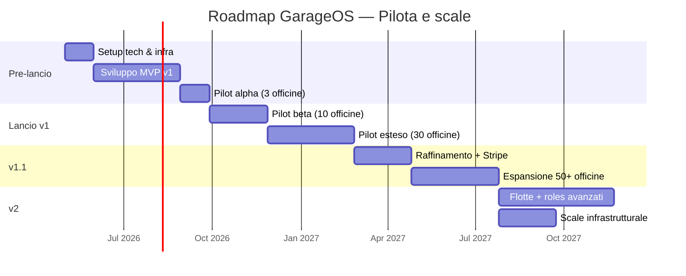

### 10.3 Fase 0 — Setup tecnico (M0-M1)

**Durata:** ~4 settimane

**Obiettivo:** infrastruttura di base pronta per iniziare lo sviluppo.

**Deliverable:**
- Account AWS configurato (eu-central-1)
- Cognito User Pool (officine + clienti) creati
- Database Supabase configurato, schema iniziale migrato
- Repository GitHub con struttura monorepo (backend, web-app, mobile-app, shared types)
- Pipeline CI/CD base (GitHub Actions + App Runner deploy)
- Dominio registrato (`garageos.it` o simile), SSL configurato
- Sentry setup, CloudWatch log groups
- IaC (AWS CDK) con ambiente production unico

**Stato documentazione:** congelamento documento v1.0 (consolidamento dopo v0.11 finale)

### 10.4 Fase 1 — MVP Core (M2-M4)

**Durata:** ~12 settimane

**Obiettivo:** funzionalità 🟢 MUST della Sezione 3 implementate.

**Blocchi di lavoro suggeriti:**

**Sprint 1-2 (settimane 1-4):** Fondamenta backend
- Schema Prisma completo (§6)
- Autenticazione Cognito integrata
- RLS PostgreSQL policies
- Endpoint Tenant, Location, User (gestione account officina)
- Seed dati `intervention_types` di sistema

**Sprint 3-4 (settimane 5-8):** Core veicoli e interventi
- Endpoint Vehicle (CRUD, certify, search)
- Generazione codice GarageOS + PDF tag
- Endpoint Customer e CustomerTenantRelation
- Endpoint Intervention (creazione, modifica wiki)
- Scheduler scadenze con EventBridge

**Sprint 5-6 (settimane 9-12):** Frontend web + mobile base
- Web app: dashboard, ricerca, scheda veicolo, form intervento, scadenzario
- Mobile app: onboarding, aggiunta veicolo via codice/QR, timeline veicolo, interventi privati
- Notifiche push via Expo
- Email transazionali via SES (inviti, promemoria)

**Milestone M4 = alpha release**

### 10.5 Fase 2 — Pilot Alpha (M5)

**Durata:** 4 settimane

**Obiettivo:** validare il sistema con 3-5 officine "amiche" in ambiente reale con dati reali.

**Criteri di successo:**
- 3 officine attivamente usano il sistema per almeno 2 settimane
- Almeno 50 veicoli registrati nel sistema
- Almeno 100 interventi registrati
- Nessun bug critico non risolto >72h
- Feedback positivo sulla UX base

**Attività:**
- Onboarding manuale delle officine (istruzioni in presenza)
- Training meccanici (1 ora ciascuno)
- Raccolta feedback settimanale strutturato (form + chiamata)
- Fix + piccoli enhancement rapidi
- Definizione metriche operative del pilota

### 10.6 Fase 3 — Pilot Beta (M6-M7)

**Durata:** ~8 settimane

**Obiettivo:** estendere a 10 officine, consolidare UX, introdurre feature SHOULD.

**Attività:**
- Onboarding self-service via web (non più solo manuale)
- Feature 🟡 SHOULD prioritarie: allegati foto, gestione contestazioni, reportistica base
- Onboarding rivolto al cliente finale: promo lato app store, QR code sui tag
- Revisioni UX basate sui feedback alpha
- Monitoring KPI business (numero claim, tasso attivazione clienti)

**Metrics target:**
- 10 officine attive
- 500 veicoli
- 200 clienti finali registrati
- Tasso di claim > 30%

### 10.7 Fase 4 — Pilot Esteso (M8-M10)

**Durata:** ~12 settimane

**Obiettivo:** arrivare alla prima massa critica geografica (30-50 officine in una città/regione).

**Attività:**
- Marketing mirato (eventi settore, visite commerciali in città pilota)
- Ottimizzazioni performance su base di traffico reale
- Eventi stampa/PR regionali
- Primo vero stress test del sistema

**Metrics target v1 (fine M10):**
- 30-50 officine attive
- 3.000+ veicoli
- 1.500+ clienti finali
- Retention mensile officine >90%
- NPS officine >30

### 10.8 Fase 5 — v1.1 (M11-M13)

**Durata:** ~12 settimane

**Obiettivo:** consolidare il sistema per scale + introdurre features premium.

**Features v1.1 chiave:**
- Integrazione **Stripe** per billing self-service
- SMS fallback per scadenze critiche
- Ambiente **staging** dedicato
- **Upstash Redis** per caching
- **Validazione OCR** libretti per claim autonomo
- Ruolo **Receptionist** (F-OFF-004 esteso)
- **Import clienti CSV** (F-OFF-207)
- Link condivisione storico veicolo (F-CLI-502)
- Pentest esterno

### 10.9 Fase 6 — v2 Scale (M14+)

**Durata:** open-ended

**Obiettivi v2:**
- Migrazione infrastrutturale: App Runner → ECS Fargate, Supabase → RDS (se dimensione lo richiede)
- **Flotte aziendali** (ruolo dedicato, gestione multi-veicolo)
- **Co-intestazione veicolo** (più proprietari)
- **Ruoli avanzati officine** (Responsabile sede, Sola lettura)
- **Scadenze automatiche** di sistema (revisione, bollo) via integrazione API Motorizzazione
- **Dark mode**
- **Multi-lingua** (inglese + tedesco per espansione)
- **Calendario appuntamenti** integrato
- **Firma digitale** interventi (se richiesta dal mercato)
- **Integrazioni con gestionali esistenti** (webhook, API Partner)

### 10.10 Criteri go/no-go

**Prima del lancio Pilot Beta (M5 → M6):**
- ✅ Zero bug critici aperti
- ✅ Latency p95 entro target (§9.1)
- ✅ Feedback positivo >80% dalle 3 officine alpha
- ✅ DPIA completata
- ✅ Testing GDPR-compliance

**Prima del lancio Pilot Esteso (M7 → M8):**
- ✅ Retention >70% dalle 10 officine beta
- ✅ Almeno 30% dei clienti invitati hanno installato l'app
- ✅ Nessun incidente sicurezza
- ✅ Disponibilità >99% nel mese precedente

**Prima della v1.1 (M10 → M11):**
- ✅ 50 tenant stabili
- ✅ Pentest esterno superato
- ✅ Business case positivo (costi < ricavi pilota)

### 10.11 Rischi e mitigazioni della roadmap

| Rischio | Probabilità | Impatto | Mitigazione |
|---|---|---|---|
| Difficoltà onboarding officine tradizionali | Alta | Alto | Training in presenza, supporto umano, UX iper-semplificata |
| Adozione bassa lato cliente finale | Media | Alto | Tag QR fisici visibili, email post-intervento, incentivi ("vedi storico gratis") |
| Competizione da gestionali esistenti che copiano | Media | Medio | Focalizzare su feature rete (cross-tenant) difficili da replicare |
| Problemi di performance con crescita | Bassa | Medio | Monitoring proattivo, piano migrazione già documentato |
| Ritardi nel time-to-market | Media | Medio | Scope v1 ridotto al minimo, feature SHOULD rimandabili |
| Issue regulatory (GDPR, accesso dati veicolo) | Bassa | Alto | DPIA ex-ante, legale consultato, trasparenza by design |
| Costi infrastrutturali superiori al previsto | Bassa | Basso | Monitoring budget settimanale, piano downscale disponibile |

---

## 11. Glossario & Appendici

### 11.1 Glossario

**Termini di dominio (business):**

- **Acquirente di usato**: persona che acquista un veicolo di seconda mano. Non è un utente registrato, ma può consultare lo storico condiviso dal venditore prima dell'acquisto. Moltiplicatore di valore percepito del sistema (Persona C)

- **Audit log**: registro delle operazioni effettuate sul sistema. Include accessi a schede veicoli, modifiche a dati sensibili, operazioni amministrative. Pattern append-only

- **Badge tenant**: nella vista timeline del cliente, indicatore visuale che mostra quale officina ha registrato ciascun intervento

- **Claim (del veicolo)**: processo con cui un proprietario finale associa la propria identità a un veicolo presente nel sistema, inserendo il codice GarageOS

- **Codice GarageOS (o codice veicolo)**: identificatore univoco interno generato dal sistema per ogni veicolo al momento del primo censimento. Formato `GO-NNN-AAAA`. Immutabile e indipendente da targa/VIN

- **Contestazione**: azione con cui un cliente segnala di non riconoscere o non essere d'accordo con un intervento registrato da un'officina. L'intervento resta nello storico ma è marcato come contestato

- **Certificazione (veicolo)**: atto con cui un'officina autorizzata promuove un veicolo da stato `pending` a `certified`, generando il codice GarageOS ufficiale

- **Intervento officina**: operazione registrata da un'officina su un veicolo. Certificata, visibile a tutti i futuri proprietari, soggetta a regole wiki di modifica

- **Intervento privato**: operazione registrata dal proprietario nella sua area personale. Non certificata, non trasferibile al nuovo proprietario

- **Location**: sede fisica di un tenant. Un tenant ha una o più location

- **Passaggio di proprietà**: trasferimento della titolarità di un veicolo da un utente finale a un altro. Il nuovo proprietario inserisce il codice GarageOS del veicolo; lo storico officina viene mantenuto, gli interventi privati del precedente proprietario restano nascosti

- **Scadenza (deadline)**: configurazione che indica quando un veicolo avrà bisogno di un nuovo intervento. Configurata dall'officina, genera promemoria automatici al cliente finale

- **Tag fisico**: adesivo con codice e QR applicato al veicolo dall'officina al momento della certificazione. Rende il codice sempre reperibile

- **Tenant**: azienda cliente del SaaS (officina singola o catena di officine). Unità di isolamento dei dati nel sistema multi-tenant

- **Veicolo certificato**: veicolo censito da un'officina autorizzata, con codice GarageOS attivo e dati verificati dal libretto fisico

- **Veicolo pendente**: veicolo registrato autonomamente da un utente, in attesa di validazione da parte di un'officina. Supporta solo interventi privati

- **Wiki (modifica wiki)**: finestra temporale di 48 ore (o fino al primo accesso del cliente) entro la quale un intervento può essere modificato liberamente. Oltre, le modifiche sono sempre tracciate

**Termini tecnici (architetturali):**

- **Cursor-based pagination**: tecnica di paginazione in cui il client passa un cursore opaco per ottenere il batch successivo. Più performante di offset-based

- **EventBridge Scheduler**: servizio AWS per schedulare esecuzioni one-time o ricorrenti. Usato per promemoria scadenze

- **Idempotency Key**: header opzionale che permette di identificare univocamente una richiesta. Richieste con stessa chiave sono trattate come duplicati e restituiscono lo stesso risultato

- **JWT (JSON Web Token)**: token firmato contenente claim. Usato per autenticazione stateless

- **Managed workflow (Expo)**: modalità Expo in cui la build è gestita interamente da Expo senza toccare codice nativo

- **Monorepo**: repository unico con più packages (backend, web, mobile, shared)

- **Multi-tenant (shared schema)**: pattern in cui un unico database contiene dati di tutti i tenant, isolati tramite `tenant_id` e RLS

- **Presigned URL**: URL firmato che consente upload/download diretto su S3 senza passare dal backend

- **PWA (Progressive Web App)**: web app installabile con capacità simili a native (notifiche push, offline)

- **RLS (Row Level Security)**: funzionalità PostgreSQL che filtra automaticamente righe in base a policy configurate, indipendente dall'applicazione

- **RTO (Recovery Time Objective)**: tempo massimo tollerabile per ripristinare il servizio dopo un disastro

- **RPO (Recovery Point Objective)**: massima perdita di dati accettabile in caso di disastro (espressa in tempo)

- **Soft delete**: cancellazione logica con flag `deleted_at` invece di rimozione fisica

- **UUID v7**: versione di UUID time-ordered, permette ordinamento cronologico naturale

- **WAF (Web Application Firewall)**: filtro di sicurezza di livello applicativo

### 11.2 Acronimi

| Acronimo | Significato |
|---|---|
| API | Application Programming Interface |
| APNS | Apple Push Notification Service |
| AWS | Amazon Web Services |
| CDK | Cloud Development Kit |
| CDN | Content Delivery Network |
| DPA | Data Processing Agreement |
| DPIA | Data Protection Impact Assessment |
| E2E | End-to-End |
| FCM | Firebase Cloud Messaging |
| GDPR | General Data Protection Regulation |
| IaC | Infrastructure as Code |
| JWT | JSON Web Token |
| KPI | Key Performance Indicator |
| LTS | Long Term Support |
| MFA | Multi-Factor Authentication |
| MVP | Minimum Viable Product |
| NPS | Net Promoter Score |
| ORM | Object Relational Mapping |
| PII | Personally Identifiable Information |
| RBAC | Role-Based Access Control |
| RLS | Row Level Security |
| RPO | Recovery Point Objective |
| RTO | Recovery Time Objective |
| S3 | Simple Storage Service (AWS) |
| SaaS | Software as a Service |
| SDK | Software Development Kit |
| SES | Simple Email Service (AWS) |
| SLA | Service Level Agreement |
| SQS | Simple Queue Service (AWS) |
| SSL | Secure Sockets Layer |
| TLS | Transport Layer Security |
| TOTP | Time-based One-Time Password |
| VIN | Vehicle Identification Number (telaio) |
| WAF | Web Application Firewall |

### 11.3 Struttura complessiva dei documenti

Il progetto GarageOS è descritto dai seguenti documenti, pensati per essere letti insieme:

| Documento | Scopo | Target lettore |
|---|---|---|
| `GarageOS-Specifiche.md` | Documento master, visione + architettura | Tutti gli stakeholder |
| `APPENDICE_A_API.md` | Dettaglio endpoint REST | Developer backend/frontend |
| `APPENDICE_B_DATABASE.md` | **Schema Prisma + SQL + validator Zod + seed** | Developer backend |
| `APPENDICE_C_INFRASTRUCTURE.md` | **AWS CDK + GitHub + Supabase setup + CI/CD** | DevOps, developer backend |
| `APPENDICE_E_TESTING.md` | **Testing strategy, pattern, CI** | Developer, QA |
| `APPENDICE_F_BUSINESS_LOGIC.md` | **Regole di business esplicite** (prevale in caso di ambiguità) | Developer, QA |
| `APPENDICE_G_ERROR_CODES.md` | **Catalogo error code API + eccezioni + localizzazione** | Developer backend/frontend |
| `garageos-officina-design.jsx` | Mockup React web officina | Designer, developer frontend |
| `garageos-cliente-design.jsx` | Mockup React mobile app | Designer, developer mobile |

**Documenti futuri pianificati:**

- `APPENDICE_D_OPERATIONS.md` — runbook operativi, procedure DR
- `APPENDICE_H_EMAIL_TEMPLATES.md` — template email transazionali
- `APPENDICE_I_THREAT_MODEL.md` — threat model secondo STRIDE

### 11.4 Convenzioni di naming utilizzate

**Funzionalità:** `F-{AREA}-{NUMERO}` dove AREA ∈ {OFF, CLI, ADM}
- Es. `F-OFF-301` = funzionalità officina numero 301 (intervento creazione)

**User flow:** `Flusso 4.X` con X progressivo

**Decisioni architetturali:** punti elencati in §1.9 con checkmark ✅

**Priorità:** 🟢 MUST, 🟡 SHOULD, 🔵 COULD, ⚪ v2, ❓ OPEN

### 11.5 Note di controllo versione del documento

Questo documento è **vivo e incrementale**. Al passaggio a Claude Code per lo sviluppo:

1. Consolidare come **v1.0 finale** quando tutte le sezioni sono complete e revisionate
2. Congelarlo in un tag Git all'inizio dello sviluppo (`docs-v1.0`)
3. Modifiche successive documentate come changelog (Appendice F futura)
4. Ogni decisione significativa modificata in corsa va riportata in §1.9 (Decisioni architetturali chiave)

### 11.6 Checklist pre-sviluppo

Prima di passare il documento a Claude Code, assicurarsi che:

- [ ] Tutte le sezioni da §1 a §11 siano completate ✅
- [ ] Nessuna questione aperta (OPEN) non chiusa
- [ ] Appendice A (API) allineata alle funzionalità della §3
- [ ] Mockup design realizzati per le schermate chiave
- [ ] Stack tecnologico confermato e non ci siano dubbi
- [ ] Decisioni GDPR validate (opzionale: DPO consultato)
- [ ] Budget infrastrutturale approvato
- [ ] Team sviluppo identificato e risorse allocate

### 11.7 Contatti e responsabilità (da compilare)

*Questa sezione sarà popolata prima del lancio dello sviluppo.*

- **Product Owner**: *da definire*
- **Tech Lead**: *da definire*
- **Designer Lead**: *da definire*
- **DPO (Data Protection Officer)**: *da definire se necessario*
- **Account manager AWS**: *da definire*

---

## Conclusione

Questo documento rappresenta la specifica funzionale e tecnica completa del sistema **GarageOS** per la sua v1 (MVP del pilota). È il punto di partenza per lo sviluppo operativo e il riferimento per tutte le decisioni progettuali.

Il sistema mira a digitalizzare il libretto di manutenzione veicoli in un modello SaaS multi-tenant, con un approccio di **registro tecnico condiviso** tra officine e con un **effetto rete** che cresce con l'adozione. L'architettura è progettata per essere **economica nella fase pilota** e **scalabile** senza riscritture maggiori fino a migliaia di tenant.

Le decisioni prese — dal posizionamento (registro tecnico, non gestionale) al modello di codice veicolo (generato dall'officina, persistente per la vita del veicolo), alle scelte tecnologiche (Node.js + TypeScript + PostgreSQL + React Native con Expo) — sono coerenti con l'obiettivo di costruire un sistema **distintivo, affidabile e sostenibile economicamente**.

La prossima fase è l'implementazione. Il documento è pronto per essere passato al team di sviluppo (Claude Code o umano) come base di partenza operativa.

---

*Documento redatto in fase progettuale, aprile 2026.*
*Versione: v1.0 (candidate)*
